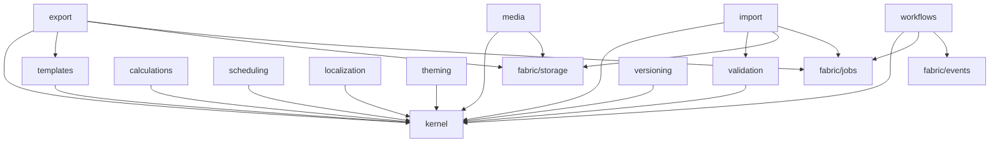

# @mcv/shared — Implementation Plan
## Phased Development Roadmap

**Package:** `@mcv/shared`  
**Classification:** INTERNAL  
**Version:** 1.0.0  
**Last Updated:** February 9, 2026

---

## Executive Summary

The `@mcv/shared` package provides cross-cutting business utilities that all domain packages depend on. Implementation must be carefully sequenced to avoid blocking dependent packages while ensuring a solid foundation.

**Total Estimated Effort:** 18-22 weeks  
**Team Size:** 2-3 full-stack engineers  
**Priority:** P0 (Critical Path)

---

## Implementation Phases

### Phase 1: Foundation (Weeks 1-3)

**Goal:** Establish core infrastructure and most-used utilities.

#### Week 1: Project Setup & Templates Core

| Task | Effort | Owner | Dependencies |
|------|--------|-------|--------------|
| Initialize package structure with Turborepo | 0.5d | DevOps | None |
| Configure TypeScript, ESLint, Vitest | 0.5d | DevOps | Package init |
| Create base Drizzle schemas | 1d | Backend | TypeScript config |
| Implement Template model and migrations | 1d | Backend | Drizzle schemas |
| Build TemplateEngine core (Handlebars-based) | 2d | Backend | Template model |

**Deliverables:**
- [ ] Package structure with proper exports
- [ ] Base database schemas and migrations
- [ ] Template CRUD operations
- [ ] Basic template rendering with variables

#### Week 2: Templates Advanced & Validation

| Task | Effort | Owner | Dependencies |
|------|--------|-------|--------------|
| Template layouts and partials | 1d | Backend | TemplateEngine core |
| Helper function registration | 1d | Backend | TemplateEngine core |
| Template caching (Redis) | 1d | Backend | TemplateEngine core |
| Validation module - rule definitions | 1d | Backend | Base schemas |
| Validation module - executor | 1d | Backend | Rule definitions |

**Deliverables:**
- [ ] Full template inheritance system
- [ ] 20+ built-in helpers (formatDate, formatCurrency, etc.)
- [ ] L1/L2 template caching
- [ ] ValidationRule schema and types
- [ ] Synchronous validation execution

#### Week 3: Validation Advanced & Calculations Core

| Task | Effort | Owner | Dependencies |
|------|--------|-------|--------------|
| Async validation (unique, exists) | 1d | Backend | Validation executor |
| Conditional validation rules | 1d | Backend | Validation executor |
| Validation groups and partial validation | 0.5d | Backend | Validation executor |
| Money type with Decimal.js | 0.5d | Backend | None |
| PricingEngine - subtotal calculation | 1d | Backend | Money type |
| PricingEngine - discount application | 1d | Backend | Subtotal calc |

**Deliverables:**
- [ ] Complete validation system
- [ ] ValidationSchema CRUD
- [ ] Money type with precision arithmetic
- [ ] Line item subtotal calculation
- [ ] Discount code processing

---

### Phase 2: Core Business Logic (Weeks 4-6)

**Goal:** Complete calculations, implement workflows, and start scheduling.

#### Week 4: Tax System & Currency

| Task | Effort | Owner | Dependencies |
|------|--------|-------|--------------|
| TaxRule schema and management | 1d | Backend | Base schemas |
| Tax jurisdiction resolution | 1d | Backend | TaxRule schema |
| Tax calculation with compound/inclusive | 1d | Backend | Tax resolution |
| Currency conversion service | 1d | Backend | Money type |
| Exchange rate provider integration | 1d | Backend | Currency service |

**Deliverables:**
- [ ] Multi-jurisdiction tax rules
- [ ] Automatic tax calculation in pricing
- [ ] Real-time currency conversion
- [ ] Historical rate lookup

#### Week 5: Complete Pricing & Workflows Core

| Task | Effort | Owner | Dependencies |
|------|--------|-------|--------------|
| Full PriceCalculationResult assembly | 1d | Backend | Tax calculation |
| Pricing audit trail/breakdown | 0.5d | Backend | Price calculation |
| Proration and subscription billing helpers | 1d | Backend | Price calculation |
| WorkflowDefinition schema | 0.5d | Backend | Base schemas |
| XState machine generation | 1d | Backend | Workflow schema |
| Workflow instance persistence | 1d | Backend | XState integration |

**Deliverables:**
- [ ] Complete PricingEngine
- [ ] Calculation breakdown for auditing
- [ ] Subscription proration helpers
- [ ] Workflow state machine definitions
- [ ] Instance state persistence

#### Week 6: Workflows Advanced & Scheduling Core

| Task | Effort | Owner | Dependencies |
|------|--------|-------|--------------|
| Workflow guards and actions | 1d | Backend | XState integration |
| Workflow timeout handling | 1d | Backend | Guards/actions |
| Workflow event sourcing (history) | 1d | Backend | Instance persistence |
| CronSchedule parser and executor | 1d | Backend | Base schemas |
| CalendarEvent CRUD | 1d | Backend | Base schemas |

**Deliverables:**
- [ ] Complete workflow engine
- [ ] Workflow audit trail
- [ ] Cron job scheduling
- [ ] Calendar event management

---

### Phase 3: Scheduling & Localization (Weeks 7-9)

**Goal:** Complete scheduling, build localization system.

#### Week 7: Scheduling Complete

| Task | Effort | Owner | Dependencies |
|------|--------|-------|--------------|
| Recurrence rules (RRule) | 1d | Backend | CalendarEvent |
| Conflict detection | 1d | Backend | CalendarEvent |
| AvailabilityWindow schema and logic | 1d | Backend | Base schemas |
| BookingEngine - slot generation | 1d | Backend | Availability |
| BookingEngine - reservation | 1d | Backend | Slot generation |

**Deliverables:**
- [ ] Recurring event support
- [ ] Calendar conflict detection
- [ ] Resource availability management
- [ ] Booking slot generation
- [ ] Reservation with hold/confirm flow

#### Week 8: Localization Core

| Task | Effort | Owner | Dependencies |
|------|--------|-------|--------------|
| Translation schema and storage | 1d | Backend | Base schemas |
| ICU MessageFormat parser | 1d | Backend | Translation schema |
| Pluralization rules (CLDR) | 1d | Backend | ICU parser |
| Locale configuration | 1d | Backend | Base schemas |
| Number/date formatting | 1d | Backend | Locale config |

**Deliverables:**
- [ ] Translation CRUD
- [ ] ICU message format support
- [ ] Proper pluralization
- [ ] Locale-aware formatting

#### Week 9: Localization Advanced & Theming Core

| Task | Effort | Owner | Dependencies |
|------|--------|-------|--------------|
| Translation import/export (JSON, XLIFF) | 1d | Backend | Translation schema |
| Relative time formatting | 0.5d | Backend | Date formatting |
| Missing translation handling | 0.5d | Backend | Translation service |
| Theme schema and model | 1d | Backend | Base schemas |
| Design token system | 1d | Backend | Theme schema |
| Token inheritance/resolution | 1d | Backend | Token system |

**Deliverables:**
- [ ] Bulk translation management
- [ ] Complete date/time formatting
- [ ] Graceful fallbacks
- [ ] Theme data model
- [ ] Design token resolution

---

### Phase 4: Theming & Media (Weeks 10-12)

**Goal:** Complete Chameleon Engine, build media processing.

#### Week 10: Chameleon Engine Complete

| Task | Effort | Owner | Dependencies |
|------|--------|-------|--------------|
| Color scale generation | 1d | Backend | Token system |
| CSS variable output | 1d | Backend | Token resolution |
| Tailwind config generation | 1d | Backend | Token resolution |
| Component theme overrides | 1d | Backend | Token system |
| Theme preview/compilation | 1d | Backend | All theme work |

**Deliverables:**
- [ ] Automatic color scales
- [ ] Runtime CSS variables
- [ ] Tailwind theme generation
- [ ] Component-level theming
- [ ] Theme compilation API

#### Week 11: Media Processing Core

| Task | Effort | Owner | Dependencies |
|------|--------|-------|--------------|
| MediaAsset schema and model | 1d | Backend | Base schemas |
| Upload URL generation (presigned) | 1d | Backend | @mcv/fabric/storage |
| Sharp integration - resize | 1d | Backend | MediaAsset schema |
| Sharp integration - format/quality | 1d | Backend | Sharp resize |
| Variant generation | 1d | Backend | Sharp integration |

**Deliverables:**
- [ ] Media asset management
- [ ] Secure direct uploads
- [ ] Image resizing
- [ ] Format conversion (WebP, AVIF)
- [ ] Automatic variant generation

#### Week 12: Media Advanced

| Task | Effort | Owner | Dependencies |
|------|--------|-------|--------------|
| Media pipelines (predefined transforms) | 1d | Backend | Variant generation |
| Metadata extraction (EXIF) | 0.5d | Backend | Upload processing |
| FFmpeg integration - video basics | 1.5d | Backend | MediaAsset schema |
| Thumbnail generation for video/PDF | 1d | Backend | FFmpeg integration |
| CDN URL generation with transforms | 1d | Backend | Variant generation |

**Deliverables:**
- [ ] Configurable processing pipelines
- [ ] Automatic metadata extraction
- [ ] Basic video processing
- [ ] Document thumbnails
- [ ] Transform URLs

---

### Phase 5: Export & Import (Weeks 13-16)

**Goal:** Build comprehensive data export/import system.

#### Week 13: Export Core

| Task | Effort | Owner | Dependencies |
|------|--------|-------|--------------|
| ExportJob schema and queue | 1d | Backend | @mcv/fabric/jobs |
| CSV exporter | 1d | Backend | ExportJob schema |
| Excel builder (ExcelJS) | 1.5d | Backend | ExportJob schema |
| Large file streaming | 1d | Backend | CSV/Excel exporters |
| Signed URL generation | 0.5d | Backend | @mcv/fabric/storage |

**Deliverables:**
- [ ] Export job management
- [ ] CSV export with options
- [ ] Excel export with formatting
- [ ] Memory-efficient streaming
- [ ] Secure download URLs

#### Week 14: PDF Generation

| Task | Effort | Owner | Dependencies |
|------|--------|-------|--------------|
| Puppeteer/Playwright PDF setup | 1d | Backend | None |
| Template → HTML → PDF pipeline | 1.5d | Backend | Templates module |
| Header/footer support | 0.5d | Backend | PDF pipeline |
| Multi-page handling | 0.5d | Backend | PDF pipeline |
| PDF security (password, permissions) | 0.5d | Backend | PDF pipeline |
| Watermark support | 0.5d | Backend | PDF pipeline |

**Deliverables:**
- [ ] Template-based PDF generation
- [ ] Professional headers/footers
- [ ] Page break handling
- [ ] PDF encryption
- [ ] Watermarking

#### Week 15: Import Core

| Task | Effort | Owner | Dependencies |
|------|--------|-------|--------------|
| ImportJob schema and workflow | 1d | Backend | Base schemas |
| CSV parser with streaming | 1d | Backend | ImportJob schema |
| Excel parser (multi-sheet) | 1d | Backend | ImportJob schema |
| Column auto-detection | 1d | Backend | Parsers |
| Field mapping interface | 1d | Backend | Column detection |

**Deliverables:**
- [ ] Import job management
- [ ] CSV parsing with any delimiter
- [ ] Excel import with sheets
- [ ] Smart column detection
- [ ] User-configurable mapping

#### Week 16: Import Advanced

| Task | Effort | Owner | Dependencies |
|------|--------|-------|--------------|
| Field transformations | 1d | Backend | Field mapping |
| Lookup resolution (reference fields) | 1d | Backend | Field transforms |
| Row validation integration | 1d | Backend | Validation module |
| Preview mode | 0.5d | Backend | Validation |
| Batch import with progress | 1d | Backend | Validation |
| Rollback support | 0.5d | Backend | Batch import |

**Deliverables:**
- [ ] Data transformation pipeline
- [ ] Related entity lookup
- [ ] Per-row validation
- [ ] Import preview
- [ ] Progress tracking
- [ ] Failed import rollback

---

### Phase 6: Versioning & Integration (Weeks 17-18)

**Goal:** Complete versioning, polish and integrate all modules.

#### Week 17: Versioning Module

| Task | Effort | Owner | Dependencies |
|------|--------|-------|--------------|
| VersionedEntity schema | 1d | Backend | Base schemas |
| Automatic version tracking trigger | 1d | Backend | VersionedEntity |
| Diff generation (jsondiffpatch) | 1d | Backend | Version tracking |
| ChangeLog schema and population | 1d | Backend | Version tracking |
| Version comparison and restore | 1d | Backend | VersionedEntity |

**Deliverables:**
- [ ] Entity versioning
- [ ] Automatic change tracking
- [ ] Visual diff generation
- [ ] Complete audit log
- [ ] Point-in-time restore

#### Week 18: Migration System & Polish

| Task | Effort | Owner | Dependencies |
|------|--------|-------|--------------|
| Migration definition schema | 0.5d | Backend | None |
| Migration runner (DAG ordering) | 1d | Backend | Migration schema |
| Migration rollback | 0.5d | Backend | Migration runner |
| Cross-module integration tests | 1d | QA | All modules |
| Performance optimization | 1d | Backend | Integration tests |
| Documentation review | 1d | All | All modules |

**Deliverables:**
- [ ] Data migration framework
- [ ] Dependency-aware execution
- [ ] Safe rollbacks
- [ ] Complete test coverage
- [ ] Performance benchmarks
- [ ] Updated documentation

---

## Testing Strategy

### Unit Tests (Required: 90% Coverage)

```typescript
// Example: calculations module tests
describe('PricingEngine', () => {
  describe('calculatePrice', () => {
    it('calculates subtotal correctly', () => {
      const result = pricingEngine.calculate({
        items: [
          { id: '1', name: 'Item', quantity: 2, unitPrice: money('10.00', 'USD') },
        ],
        currency: 'USD',
      });
      expect(result.subtotal.amount).toBe('20.00');
    });

    it('applies percentage discount', () => {
      const result = pricingEngine.calculate({
        items: [{ id: '1', name: 'Item', quantity: 1, unitPrice: money('100.00', 'USD') }],
        currency: 'USD',
        discounts: [{ code: 'SAVE10', type: 'percentage', value: '10' }],
      });
      expect(result.discountTotal.amount).toBe('10.00');
      expect(result.total.amount).toBe('90.00');
    });

    it('calculates tax correctly', () => {
      const result = pricingEngine.calculate({
        items: [{ id: '1', name: 'Item', quantity: 1, unitPrice: money('100.00', 'USD') }],
        currency: 'USD',
        taxContext: { jurisdiction: 'US-CA', customerType: 'individual' },
      });
      expect(result.taxTotal.amount).toBe('7.25'); // CA sales tax
    });

    it('handles compound tax', () => { /* ... */ });
    it('handles tax-inclusive pricing', () => { /* ... */ });
    it('handles multiple discounts with stacking rules', () => { /* ... */ });
  });
});

describe('TemplateEngine', () => {
  it('renders simple variables', () => {
    const result = templateEngine.render('Hello {{name}}!', { name: 'World' });
    expect(result).toBe('Hello World!');
  });

  it('escapes HTML by default', () => {
    const result = templateEngine.render('{{content}}', { content: '<script>alert(1)</script>' });
    expect(result).toBe('&lt;script&gt;alert(1)&lt;/script&gt;');
  });

  it('handles conditionals', () => { /* ... */ });
  it('handles loops', () => { /* ... */ });
  it('resolves partials', () => { /* ... */ });
  it('applies layouts', () => { /* ... */ });
});
```

### Integration Tests

```typescript
describe('Template → Export Integration', () => {
  it('generates PDF from template', async () => {
    const template = await templateService.create(ventureId, {
      type: 'document',
      name: 'Invoice',
      body: invoiceTemplateHtml,
    });

    const exportJob = await exportService.create(ventureId, userId, {
      format: 'pdf',
      name: 'Invoice Export',
      templateId: template.id,
      query: { entityType: 'invoice', filters: { id: invoiceId } },
    });

    await waitForJob(exportJob.id);

    const result = await exportService.get(ventureId, exportJob.id);
    expect(result.status).toBe('completed');
    expect(result.output?.mimeType).toBe('application/pdf');
  });
});

describe('Workflow → Notifications Integration', () => {
  it('sends notification on state transition', async () => {
    const workflow = await workflowService.createDefinition(ventureId, {
      name: 'Approval',
      initialState: 'pending',
      states: [
        { name: 'pending', type: 'initial' },
        { 
          name: 'approved', 
          type: 'final',
          onEntry: [{ type: 'notify', name: 'approval_notification' }],
        },
      ],
      transitions: [
        { from: 'pending', to: 'approved', event: 'approve' },
      ],
    });

    const instance = await workflowService.startInstance(ventureId, {
      definitionId: workflow.id,
    });

    await workflowService.transition(ventureId, {
      instanceId: instance.id,
      event: 'approve',
    });

    // Verify notification was queued
    expect(notificationQueue.jobs).toContainEqual(
      expect.objectContaining({ type: 'approval_notification' })
    );
  });
});
```

### Performance Tests

| Operation | Target | Method |
|-----------|--------|--------|
| Template render (simple) | < 5ms | Benchmark suite |
| Template render (complex) | < 50ms | Benchmark suite |
| Price calculation (10 items) | < 10ms | Benchmark suite |
| Validation (100 rules) | < 100ms | Benchmark suite |
| Image resize (1MB) | < 500ms | Load test |
| CSV export (10k rows) | < 5s | Load test |
| CSV import (10k rows) | < 30s | Load test |

---

## Risk Mitigation

### Technical Risks

| Risk | Impact | Mitigation |
|------|--------|------------|
| Handlebars security (XSS) | High | Strict auto-escaping, CSP headers |
| Decimal precision errors | High | Use Decimal.js everywhere, no native floats |
| Workflow deadlocks | Medium | Timeout handling, state machine validation |
| Media processing OOM | Medium | Stream processing, memory limits, queue workers |
| Import data corruption | High | Transactions, preview mode, rollback support |

### Dependencies

| Dependency | Risk | Fallback |
|------------|------|----------|
| Sharp (image processing) | Low | Jimp (slower but pure JS) |
| FFmpeg (video) | Medium | Cloud transcoding service |
| Puppeteer (PDF) | Medium | pdfmake (limited but no browser) |
| XState (workflows) | Low | Custom FSM (significant rework) |
| ExcelJS | Low | xlsx (different API) |

---

## Module Dependencies



---

## Success Criteria

### Phase Gates

| Phase | Gate Criteria |
|-------|---------------|
| Phase 1 | Templates render, validation passes, 80% unit test coverage |
| Phase 2 | Pricing calculates correctly, workflows transition, scheduling works |
| Phase 3 | Booking system functional, translations load, i18n formatting correct |
| Phase 4 | Themes compile to CSS, images process, variants generate |
| Phase 5 | CSV/Excel/PDF export, imports with validation, 10k row performance |
| Phase 6 | Versioning tracks changes, migrations run, 90% coverage, docs complete |

### Quality Metrics

- Unit test coverage: ≥ 90%
- Integration test coverage: ≥ 80%
- Performance benchmarks: All passing
- Security scan: No critical/high vulnerabilities
- Documentation: 100% public API documented
- Type coverage: 100% (no `any` types)

---

## Team Assignments

| Engineer | Primary Focus | Secondary |
|----------|---------------|-----------|
| Engineer 1 | Templates, Validation, Calculations | Export |
| Engineer 2 | Workflows, Scheduling, Versioning | Import |
| Engineer 3 | Media, Theming, Localization | Integration |

---

## Related Documentation

- [Package Specification](./01-PACKAGE-SPEC.md)
- [Technical Architecture](./02-TECHNICAL-ARCHITECTURE.md)
- [API Reference](./03-API-REFERENCE.md)

---

*@mcv/shared — Implementation Plan v1.0.0*
