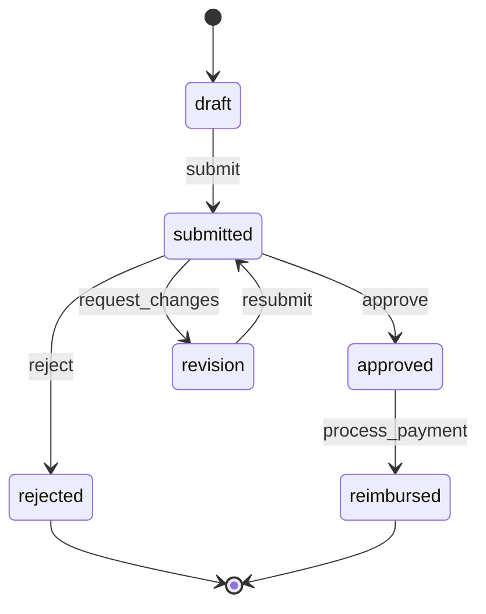

# @mcv/shared — Shared Module (Tier 2.5, INTERNAL)

> Cross-cutting shared services used by all domain packages — calculations, data import/export, localization, media processing, scheduling, templates, theming, validation, versioning, and workflows.

**Package:** `@mcv/shared`
**Classification:** INTERNAL
**Tier:** 2.5 — Shared Business Utilities
**Version:** 1.0.0
**Last Updated:** February 9, 2026

---

## Table of Contents

1. [Overview](#overview)
2. [Architecture Position](#architecture-position)
3. [Design Philosophy](#design-philosophy)
4. [Submodule Summary](#submodule-summary)
5. [Submodule Deep Dives](#submodule-deep-dives)
   - 5.1 [calculations](#51-calculations)
   - 5.2 [export](#52-export)
   - 5.3 [import](#53-import)
   - 5.4 [localization](#54-localization)
   - 5.5 [media](#55-media)
   - 5.6 [scheduling](#56-scheduling)
   - 5.7 [templates](#57-templates)
   - 5.8 [theming](#58-theming)
   - 5.9 [validation](#59-validation)
   - 5.10 [versioning](#510-versioning)
   - 5.11 [workflows](#511-workflows)
6. [Cross-Module Integration](#cross-module-integration)
7. [Shared Interfaces & Types](#shared-interfaces--types)
8. [Configuration](#configuration)
9. [Dependencies](#dependencies)
10. [Security](#security)
11. [Performance](#performance)
12. [Testing Strategy](#testing-strategy)
13. [Package Exports](#package-exports)
14. [Related Documentation](#related-documentation)

---

## Overview

`@mcv/shared` is the **shared business utilities layer** of MCV.ONE. It sits at Tier 2.5 — above raw infrastructure (`@mcv/fabric`, `@mcv/api`, `@mcv/kernel`) and below the domain packages (`@mcv/ventures`, `@mcv/commerce`, `@mcv/community`, `@mcv/jobs`, `@mcv/finance`). Its purpose is singular and critical: **transform raw infrastructure primitives into business-ready building blocks that domain packages compose into complete features.**

Every domain package needs calculations, validations, templates, and workflows. Without a shared layer, each domain would re-invent these capabilities — leading to inconsistency, duplication, and drift. `@mcv/shared` eliminates that by providing a single, tested, venture-aware implementation of each cross-cutting concern.

### What This Package Does

- **calculations** — Precision financial math: pricing engines, tax computation, currency conversion, discount stacking, proration, and rounding rules
- **export** — Generate downloadable files: PDF reports, CSV data dumps, Excel workbooks, with template support, streaming, and scheduling
- **import** — Ingest external data: CSV/Excel/JSON parsing, field mapping, row-level validation, deduplication, preview, and rollback
- **localization** — Full i18n/l10n: ICU MessageFormat translations, pluralization, number/date/currency formatting, RTL support, locale detection
- **media** — Asset processing: image resize/crop/optimize, video transcoding, thumbnail generation, CDN integration, responsive srcsets
- **scheduling** — Time logic: cron expressions, recurring events (RRule), booking/availability engines, timezone-aware operations, conflict detection
- **templates** — Content generation: email/document/notification templates, Handlebars engine, partials, helpers, safe rendering, preview mode
- **theming** — The Chameleon Engine: design tokens, semantic color scales, venture-specific branding, dark mode, CSS custom properties, Tailwind integration
- **validation** — Business rule enforcement: declarative rules, cross-field checks, async validation, conditional rules, localized error messages, validation groups
- **versioning** — Data evolution: schema migrations, entity version tracking, change history with diffs, rollback support, conflict resolution
- **workflows** — Process automation: declarative state machines, guards, actions, hooks, parallel states, timeout handling, event-sourced audit trails

### What This Package Does NOT Do

- **Does not own domain entities.** Commerce owns products and orders; shared provides the calculation engine commerce calls.
- **Does not expose public API routes.** Domain packages mount their own tRPC routers; shared provides the logic those routers invoke.
- **Does not manage infrastructure.** Storage, queues, and databases are `@mcv/fabric`'s responsibility; shared uses them via well-defined interfaces.
- **Does not replace kernel primitives.** Types like `UUID`, `VentureID`, and `ISOTimestamp` come from `@mcv/kernel`; shared builds on them.

### Business Value

| Module | Business Value | Primary Consumers |
|--------|----------------|-------------------|
| calculations | Financial accuracy across all ventures | commerce, finance, jobs |
| export | Data portability, regulatory compliance | All domains |
| import | Customer onboarding, data migration | ventures, commerce, community |
| localization | Global market reach, cultural adaptation | All domains, UI |
| media | Rich content experiences | community, commerce, ventures |
| scheduling | Time management, automation triggers | jobs, commerce, community |
| templates | Branded, consistent communications | All domains |
| theming | White-label customization per venture | UI, ventures |
| validation | Data integrity, user experience | All domains, API |
| versioning | Safe schema evolution, audit trails | All domains, fabric |
| workflows | Process automation, approval chains | All domains |

---

## Architecture Position

```
┌──────────────────────────────────────────────────────────────────────────────┐
│                           DOMAIN PACKAGES (Tier 5)                           │
│                                                                              │
│   @mcv/ventures   @mcv/commerce   @mcv/community   @mcv/jobs   @mcv/finance │
│                                                                              │
└──────────────────────────────────────────────────────────────────────────────┘
                                       │
                                       │ uses (composes shared building blocks)
                                       ▼
┌──────────────────────────────────────────────────────────────────────────────┐
│                               @mcv/shared                                    │
│                          Tier 2.5: Shared Services                           │
│                                                                              │
│   ┌────────────┐ ┌────────────┐ ┌────────────┐ ┌────────────┐              │
│   │ calculations│ │  export    │ │  import    │ │localization│              │
│   └────────────┘ └────────────┘ └────────────┘ └────────────┘              │
│                                                                              │
│   ┌────────────┐ ┌────────────┐ ┌────────────┐ ┌────────────┐              │
│   │   media    │ │ scheduling │ │ templates  │ │  theming   │              │
│   └────────────┘ └────────────┘ └────────────┘ └────────────┘              │
│                                                                              │
│   ┌────────────┐ ┌────────────┐ ┌────────────┐                              │
│   │ validation │ │ versioning │ │ workflows  │                              │
│   └────────────┘ └────────────┘ └────────────┘                              │
│                                                                              │
└──────────────────────────────────────────────────────────────────────────────┘
                                       │
                           ┌───────────┼───────────┐
                           │           │           │
                           ▼           ▼           ▼
                  ┌──────────────┐ ┌─────────┐ ┌───────────────┐
                  │ @mcv/fabric  │ │@mcv/api │ │@mcv/connectors│
                  │   (Tier 2)   │ │(Tier 1) │ │   (Tier 3)    │
                  └──────────────┘ └─────────┘ └───────────────┘
                           │           │           │
                           └───────────┼───────────┘
                                       │
                                       ▼
                              ┌──────────────┐
                              │  @mcv/kernel  │
                              │   (Tier 0)    │
                              └──────────────┘
```

### Dependency Rules

1. **Shared → Kernel:** Direct dependency on core types and primitives.
2. **Shared → Fabric:** Uses storage (file uploads, exports), jobs (background processing), events (workflow transitions), audit (change tracking).
3. **Shared → API:** Registers tRPC sub-routers for administration endpoints (template CRUD, workflow definitions, etc.).
4. **Shared → Connectors:** Uses external services (email delivery, payment gateways for currency rates, CDN).
5. **Shared ← Domain packages:** Domain packages import shared utilities. Shared never imports from domain packages.
6. **Shared ↔ Shared (internal):** Submodules may reference each other (e.g., `templates` uses `localization`; `export` uses `templates`; `workflows` uses `validation`).

---

## Design Philosophy

### 1. Venture-Scoped by Default

Every shared service is venture-aware. Templates belong to a venture. Tax rules are venture-specific. Themes are per-venture. This is not optional — it's structural.

```typescript
// Every service constructor or factory accepts VentureID
const pricing = new PricingEngine({ ventureId: 'ven_acme' });
const theme = await ThemeEngine.resolve({ ventureId: 'ven_acme', mode: 'dark' });
const translations = await i18n.load({ ventureId: 'ven_acme', locale: 'fr-CA' });
```

### 2. Stateless Logic, Externalized State

Shared services are pure computation. They receive inputs and produce outputs. State lives in the database (via `@mcv/fabric`). This makes them testable, cacheable, and horizontally scalable.

```typescript
// Stateless: input → output
const result = PricingEngine.calculate(items, taxContext, discounts);
// State managed externally
await db.orders.update(orderId, { total: result.total });
```

### 3. Composable, Not Monolithic

Each submodule is independently importable. Domain packages take only what they need:

```typescript
import { PricingEngine } from '@mcv/shared/calculations';
import { renderTemplate } from '@mcv/shared/templates';
// NOT: import { PricingEngine, renderTemplate } from '@mcv/shared';
```

### 4. Configuration-Driven Behavior

Behavior is controlled by configuration, not code changes. Tax rules, template layouts, validation schemas, workflow definitions — all stored as data that ventures can customize without code deployments.

### 5. Fail Loudly, Recover Gracefully

- Calculations throw on precision errors (never silently round wrong)
- Imports report per-row errors but continue processing valid rows
- Workflows log failed transitions but maintain consistent state
- Templates fall back to default locale on missing translations

---

## Submodule Summary

| # | Module | Key Exports | External Deps |
|---|--------|-------------|---------------|
| 1 | calculations | `PricingEngine`, `TaxCalculator`, `CurrencyConverter` | `decimal.js` |
| 2 | export | `PDFGenerator`, `CSVExporter`, `ExcelBuilder` | `pdfmake`, `exceljs` |
| 3 | import | `ImportParser`, `CSVImporter`, `DataMapper` | `papaparse` |
| 4 | localization | `i18n`, `translate`, `formatNumber`, `formatDate` | `i18next`, `intl-messageformat` |
| 5 | media | `MediaProcessor`, `ImageTransformer`, `VideoTranscoder` | `sharp`, `ffmpeg` (system) |
| 6 | scheduling | `Scheduler`, `BookingEngine`, `AvailabilityManager` | `node-cron`, `date-fns`, `rrule` |
| 7 | templates | `TemplateEngine`, `renderTemplate`, `registerHelper` | `handlebars`, `mjml` |
| 8 | theming | `ThemeEngine`, `createTheme`, `resolveTokens` | — (pure logic) |
| 9 | validation | `createValidator`, `validateEntity`, `ValidationRule` | `zod` |
| 10 | versioning | `MigrationRunner`, `ChangeTracker` | — (pure logic) |
| 11 | workflows | `WorkflowEngine`, `defineWorkflow` | `xstate` |

---

## Submodule Deep Dives

### 5.1 calculations

> Mathematical and financial calculation engine with precision arithmetic, formula parsing, currency conversion, tax computation, and configurable rounding rules.

#### Purpose

Financial calculations demand absolute precision. JavaScript's floating-point arithmetic (`0.1 + 0.2 !== 0.3`) is unacceptable for pricing, taxes, and currency. The `calculations` submodule wraps all monetary operations in `decimal.js`, enforces rounding rules per currency, and provides a complete audit trail of every computation step.

#### Core Capabilities

| Capability | Description |
|------------|-------------|
| **Decimal Precision** | All monetary values represented as `decimal.js` instances; no floating-point errors |
| **Tax Calculation** | Multi-jurisdiction tax rules: sales tax, VAT, GST, PST, HST with compound/inclusive support |
| **Pricing Tiers** | Volume discounts, subscription tiers, customer-group pricing |
| **Currency Conversion** | Real-time and historical exchange rates; crypto-to-fiat support |
| **Discount Stacking** | Multiple discount rules applied in configurable order with cap limits |
| **Proration** | Partial-period billing for subscription upgrades/downgrades |
| **Rounding Rules** | Per-currency rounding (JPY rounds to integer, USD to 2 decimals) |
| **Formula Parser** | Custom formula expressions for dynamic pricing (`base * quantity * (1 - discount)`) |
| **Commission Calculation** | Revenue sharing: affiliate fees, marketplace takes, split payments |
| **Audit Trail** | Every calculation produces a full breakdown showing each step |

#### Architecture

```
┌─────────────────────────────────────────────────────────────────┐
│                        PricingEngine                             │
│                                                                  │
│  ┌──────────┐  ┌──────────┐  ┌──────────┐  ┌──────────────┐   │
│  │ LineItem │  │ Discount │  │   Tax    │  │  Commission  │   │
│  │ Resolver │  │ Stacker  │  │Calculator│  │  Calculator  │   │
│  └────┬─────┘  └────┬─────┘  └────┬─────┘  └──────┬───────┘   │
│       │              │             │                │            │
│       └──────────────┴─────────────┴────────────────┘            │
│                              │                                   │
│                    ┌─────────▼─────────┐                        │
│                    │  CalculationPipe  │                        │
│                    │  (audit trail)    │                        │
│                    └─────────┬─────────┘                        │
│                              │                                   │
│                    ┌─────────▼─────────┐                        │
│                    │  RoundingEngine   │                        │
│                    │  (per-currency)   │                        │
│                    └─────────┬─────────┘                        │
│                              │                                   │
│                    ┌─────────▼─────────┐                        │
│                    │   Money Output    │                        │
│                    └───────────────────┘                        │
└─────────────────────────────────────────────────────────────────┘
                               │
                    ┌──────────▼──────────┐
                    │  CurrencyConverter  │
                    │  (rates from       │
                    │   @mcv/connectors)  │
                    └─────────────────────┘
```

#### Key Types

```typescript
interface Money {
  amount: string;           // Decimal string for precision (e.g., "19.99")
  currency: CurrencyCode;   // ISO 4217 (e.g., "USD", "EUR", "JPY")
  display: string;           // Formatted for display (e.g., "$19.99")
}

interface PriceCalculation {
  input: {
    items: LineItem[];
    currency: CurrencyCode;
    taxContext: TaxContext;
    discounts: DiscountCode[];
    customer?: CustomerContext;
  };
  output: {
    subtotal: Money;
    discounts: AppliedDiscount[];
    discountTotal: Money;
    taxableAmount: Money;
    taxes: AppliedTax[];
    taxTotal: Money;
    total: Money;
    breakdown: CalculationBreakdown[];
  };
}

interface LineItem {
  id: string;
  name: string;
  unitPrice: Money;
  quantity: number;
  taxCategory?: string;       // Product tax category
  discountable: boolean;
  metadata?: Record<string, unknown>;
}

interface TaxContext {
  jurisdiction: string;       // Country/state/province code
  customerType: 'individual' | 'business';
  taxExempt: boolean;
  taxId?: string;
  shippingAddress?: Address;
  billingAddress?: Address;
}

interface TaxRule {
  id: UUID;
  ventureId: VentureID;
  name: string;
  jurisdiction: string;
  type: 'sales_tax' | 'vat' | 'gst' | 'pst' | 'hst';
  rate: string;               // Decimal rate (e.g., "0.13" for 13%)
  compound: boolean;          // Tax on tax
  inclusive: boolean;          // Tax included in price
  categories: string[];       // Product categories this applies to
  validFrom: ISOTimestamp;
  validTo?: ISOTimestamp;
}

interface AppliedTax {
  ruleId: UUID;
  name: string;
  jurisdiction: string;
  rate: string;
  amount: Money;
  taxableAmount: Money;
  inclusive: boolean;
}

interface AppliedDiscount {
  code: string;
  name: string;
  type: 'percentage' | 'fixed' | 'buy_x_get_y';
  value: string;
  amount: Money;
  appliedTo: string[];        // Line item IDs
}

interface CalculationBreakdown {
  step: string;
  description: string;
  input: string;
  output: string;
  formula: string;
}

interface CurrencyRate {
  from: CurrencyCode;
  to: CurrencyCode;
  rate: string;               // Decimal string
  source: string;             // Rate provider
  timestamp: ISOTimestamp;
  type: 'live' | 'historical';
}

interface RoundingRule {
  currency: CurrencyCode;
  decimals: number;           // 2 for USD, 0 for JPY
  mode: 'half_up' | 'half_down' | 'half_even' | 'ceil' | 'floor';
  smallest_unit?: string;     // "0.05" for CHF (rounds to nearest 5 centimes)
}

interface FormulaContext {
  variables: Record<string, string>;  // Decimal string values
  functions: Record<string, (...args: string[]) => string>;
}
```

#### Calculation Flows

**Standard Order Calculation:**
```
1. Resolve line items → unit prices × quantities = line totals
2. Apply discounts → percentage/fixed/BXGY in configured order
3. Compute taxable amount → subtotal - non-taxable items
4. Apply tax rules → per-jurisdiction, per-category rates
5. Handle compound taxes → tax-on-tax if applicable
6. Apply rounding → per-currency rounding rules
7. Produce breakdown → audit trail of every step
```

**Subscription Proration:**
```
1. Determine billing period (monthly/yearly)
2. Calculate days remaining in current period
3. Compute pro-rata amount for old plan
4. Compute pro-rata amount for new plan
5. Calculate difference (credit or charge)
6. Apply to next invoice
```

**Currency Conversion:**
```
1. Fetch current rate (live) or historical rate (for reporting)
2. Apply rate with full decimal precision
3. Round to target currency's decimal rules
4. Record source rate and timestamp for audit
```

#### Tax Calculation Engine Details

The tax engine supports complex multi-jurisdiction scenarios common in e-commerce:

| Scenario | Handling |
|----------|----------|
| **US Sales Tax** | State + county + city rates, destination-based |
| **Canadian GST/PST/HST** | Federal + provincial, varies by province |
| **EU VAT** | Reverse charge for B2B, MOSS for digital goods |
| **Compound Tax** | Quebec QST applied on GST+price (tax on tax) |
| **Tax-Inclusive Pricing** | Extract tax from displayed price (common in EU) |
| **Tax Exemption** | Skip tax for exempt customers (with valid tax ID) |
| **Digital Goods** | Different rates for digital vs physical |
| **Threshold Rules** | Small seller exemptions by jurisdiction |

#### Formula Parser

The formula parser supports custom pricing expressions:

```
Supported operators: + - * / % ^ ( )
Supported functions: min(), max(), round(), ceil(), floor(), abs()
Variables: any named variable passed in context

Examples:
  "base * quantity"
  "base * quantity * (1 - discount / 100)"
  "max(base * quantity, minimum_order)"
  "round(base * (1 + markup / 100), 2)"
```

#### Integration Points

| Integrates With | Direction | Purpose |
|-----------------|-----------|---------|
| `@mcv/commerce/orders` | ← called by | Order total calculations |
| `@mcv/commerce/subscriptions` | ← called by | Recurring billing, proration |
| `@mcv/connectors/payments` | → calls | Currency rates, payment amounts |
| `@mcv/shared/export` | → used by | Financial report generation |
| `@mcv/shared/localization` | → used by | Currency display formatting |
| `@mcv/finance` | ← called by | Revenue calculations, commissions |

#### Configuration

```typescript
interface CalculationsConfig {
  defaultCurrency: CurrencyCode;
  roundingRules: RoundingRule[];
  taxRules: TaxRule[];
  exchangeRateProvider: 'openexchangerates' | 'currencylayer' | 'manual';
  exchangeRateCacheTTL: number;    // Seconds
  discountStackingOrder: 'percentage_first' | 'fixed_first' | 'best_for_customer';
  maxDiscountPercentage: number;    // Cap total discount (e.g., 50%)
  enableAuditTrail: boolean;
  formulaTimeout: number;           // Max ms for formula evaluation
}
```

---

### 5.2 export

> Data export engine supporting CSV, Excel (XLSX), and PDF generation with template support, streaming for large datasets, scheduled recurring exports, and signed download URLs.

#### Purpose

Every SaaS platform needs data export. Users want to download their customer lists, financial reports, invoices, and analytics. Regulatory compliance (GDPR data portability, financial audits) demands it. The `export` submodule provides a unified, template-driven, background-processed export pipeline that handles everything from a 10-row CSV to a 100,000-row Excel workbook.

#### Core Capabilities

| Capability | Description |
|------------|-------------|
| **PDF Generation** | Template-based PDFs: invoices, receipts, reports, certificates |
| **CSV Export** | Configurable delimiters, encoding, column selection |
| **Excel Builder** | Multi-sheet workbooks with formatting, formulas, auto-filters |
| **Template-Based** | PDF/document exports use `@mcv/shared/templates` for layout |
| **Streaming** | Large exports streamed to storage without memory overflow |
| **Async Processing** | Background job queue for large exports |
| **Signed URLs** | Time-limited, secure download links |
| **Scheduled Exports** | Recurring exports via `@mcv/shared/scheduling` integration |
| **Column Mapping** | Map internal fields to human-readable export columns |
| **Localized Output** | Dates, numbers, currencies formatted per locale |

#### Architecture

```
┌───────────────────────────────────────────────────────────────┐
│                       Export Pipeline                          │
│                                                               │
│  ┌─────────┐    ┌──────────┐    ┌──────────┐    ┌─────────┐ │
│  │ Request │───▶│  Format  │───▶│  Stream  │───▶│ Storage │ │
│  │ Builder │    │ Renderer │    │  Writer  │    │ Upload  │ │
│  └─────────┘    └──────────┘    └──────────┘    └────┬────┘ │
│                                                       │      │
│                                                ┌──────▼────┐ │
│                                                │  Signed   │ │
│                                                │   URL     │ │
│                                                └───────────┘ │
└───────────────────────────────────────────────────────────────┘
         │                    │                     │
    ┌────▼────┐         ┌────▼────┐           ┌────▼────┐
    │   PDF   │         │   CSV   │           │  Excel  │
    │ (pdfmake│         │(streams)│           │(exceljs)│
    │ + MJML) │         │         │           │         │
    └─────────┘         └─────────┘           └─────────┘
```

#### Key Types

```typescript
interface ExportJob {
  id: UUID;
  ventureId: VentureID;
  type: 'pdf' | 'csv' | 'xlsx' | 'json';
  name: string;
  templateId?: UUID;           // For PDF exports
  data: ExportData;
  options: ExportOptions;
  status: 'queued' | 'processing' | 'completed' | 'failed';
  output?: {
    url: string;
    signedUrl: string;
    signedUrlExpires: ISOTimestamp;
    filename: string;
    size: number;
    mimeType: string;
  };
  error?: string;
  requestedBy: UserID;
  createdAt: ISOTimestamp;
  completedAt?: ISOTimestamp;
}

interface ExportData {
  source: 'query' | 'array' | 'stream';
  query?: {
    entity: string;
    filters: Record<string, unknown>;
    sort?: { field: string; direction: 'asc' | 'desc' }[];
    limit?: number;
  };
  rows?: Record<string, unknown>[];
  streamFn?: string;           // Registered stream function name
}

interface ExportOptions {
  locale: string;
  timezone: string;
  filename: string;
  format: PDFOptions | CSVOptions | ExcelOptions;
}

interface PDFOptions {
  template: string | UUID;
  pageSize: 'letter' | 'a4' | 'legal';
  orientation: 'portrait' | 'landscape';
  margins: { top: number; right: number; bottom: number; left: number };
  header?: string;
  footer?: string;
  watermark?: { text: string; opacity: number };
  tableOfContents?: boolean;
  pageNumbers?: boolean;
}

interface CSVOptions {
  delimiter: ',' | ';' | '\t';
  quote: '"' | "'";
  escape: '\\' | '"';
  header: boolean;
  columns: CSVColumn[];
  encoding: 'utf-8' | 'utf-16' | 'latin1';
  lineEnding: 'lf' | 'crlf';
  bom: boolean;                // Byte order mark for Excel compat
}

interface CSVColumn {
  field: string;               // Internal field path (dot notation)
  header: string;              // Display name in header row
  format?: (value: unknown) => string;
  width?: number;
}

interface ExcelOptions {
  sheets: ExcelSheet[];
  styles?: ExcelStyles;
  protection?: ExcelProtection;
}

interface ExcelSheet {
  name: string;
  columns: ExcelColumn[];
  data: Record<string, unknown>[];
  freezePane?: { row: number; col: number };
  autoFilter?: boolean;
  conditionalFormatting?: ConditionalFormat[];
  charts?: ChartDefinition[];
}

interface ExcelColumn {
  field: string;
  header: string;
  width: number;
  type: 'string' | 'number' | 'date' | 'currency' | 'boolean';
  format?: string;             // Excel format string (e.g., "#,##0.00")
  formula?: string;            // Column formula
}

interface ExcelStyles {
  headerFont: FontStyle;
  headerFill: FillStyle;
  dataFont: FontStyle;
  borders: BorderStyle;
  alignment: AlignmentStyle;
}

interface ScheduledExport {
  id: UUID;
  ventureId: VentureID;
  exportJobTemplate: Omit<ExportJob, 'id' | 'status' | 'output' | 'createdAt'>;
  schedule: string;            // Cron expression
  recipients: string[];        // Email addresses
  lastRun?: ISOTimestamp;
  nextRun: ISOTimestamp;
  enabled: boolean;
}
```

#### Export Types

| Type | Format | Typical Use Cases | Max Rows |
|------|--------|-------------------|----------|
| **Report** | PDF | Financial summaries, analytics dashboards | N/A (template) |
| **Invoice** | PDF | Customer invoices, order receipts | N/A (template) |
| **Receipt** | PDF | Payment confirmations | N/A (template) |
| **Data List** | CSV | Contact lists, product catalogs, logs | 100,000 |
| **Spreadsheet** | XLSX | Financial data, multi-sheet analysis | 100,000 |
| **Certificate** | PDF | Completion certificates, credentials | N/A (template) |
| **Backup** | JSON | Data portability, GDPR exports | Unlimited (streamed) |

#### Streaming Pipeline

For large exports (>10,000 rows), the export engine uses streaming:

```
Database Cursor → Transform Stream → Format Writer → Storage Upload
                                                          │
                                                    (chunked upload)
```

- CSV: rows written line by line to a write stream
- Excel: `exceljs` streaming workbook writer
- JSON: NDJSON (newline-delimited JSON) stream
- PDF: pre-aggregated (not streamed — templates need full data)

#### Integration Points

| Integrates With | Direction | Purpose |
|-----------------|-----------|---------|
| `@mcv/shared/templates` | → uses | PDF layout templates |
| `@mcv/shared/localization` | → uses | Locale-aware formatting in exports |
| `@mcv/shared/calculations` | → uses | Financial report computations |
| `@mcv/shared/scheduling` | → uses | Recurring scheduled exports |
| `@mcv/fabric/storage` | → uses | Upload generated files |
| `@mcv/fabric/jobs` | → uses | Background export processing |
| `@mcv/fabric/events` | → emits | `export.completed`, `export.failed` events |
| All domain packages | ← called by | Domains request exports of their entities |

#### Configuration

```typescript
interface ExportConfig {
  maxRowsPerExport: number;          // Default: 100,000
  maxFileSizeMB: number;             // Default: 500
  signedUrlExpiryMinutes: number;    // Default: 60
  defaultPageSize: 'letter' | 'a4';
  defaultCSVDelimiter: ',' | ';';
  defaultEncoding: 'utf-8';
  streamingThreshold: number;        // Rows before switching to streaming (default: 10,000)
  storageBucket: string;
  retentionDays: number;             // Auto-delete exports after N days
  scheduledExportEnabled: boolean;
}
```

---

### 5.3 import

> Data import pipeline with validation, CSV/Excel/JSON parsing, configurable field mapping, per-row error handling, deduplication, preview mode, and rollback support for bulk operations.

#### Purpose

Getting data into the system is one of the most error-prone operations in any SaaS platform. Users upload CSVs with missing columns, Excel files with mixed date formats, and JSON dumps from legacy systems. The `import` submodule handles all of this with a structured pipeline: parse → map → transform → validate → preview → import → report.

#### Core Capabilities

| Capability | Description |
|------------|-------------|
| **Format Detection** | Auto-detect CSV, XLSX, JSON, XML from file content |
| **Schema Mapping** | Visual field mapping from source columns to target fields |
| **Row-Level Validation** | Each row validated independently; bad rows don't block good ones |
| **Transformation** | Normalize data: trim, lowercase, date parsing, type coercion |
| **Deduplication** | Detect and handle duplicate records (skip, update, or flag) |
| **Preview Mode** | Preview first N rows with validation results before committing |
| **Partial Import** | Import valid rows, skip invalid ones, report both |
| **Progress Tracking** | Real-time progress: total, processed, succeeded, failed, skipped |
| **Rollback** | Undo a completed import (delete all created entities) |
| **Chunked Processing** | Large files processed in configurable chunks |
| **Resume Support** | Failed imports can be resumed from last successful chunk |

#### Architecture

```
┌──────────────────────────────────────────────────────────────────────┐
│                           Import Pipeline                             │
│                                                                       │
│  Upload ──▶ Parse ──▶ Map ──▶ Transform ──▶ Validate ──▶ Preview    │
│                                                              │        │
│                                                     ┌────────▼──────┐ │
│                                                     │   User       │ │
│                                                     │   Confirms   │ │
│                                                     └────────┬─────┘ │
│                                                              │        │
│                                              Import ◀────────┘        │
│                                                 │                     │
│                                           ┌─────▼─────┐              │
│                                           │  Report   │              │
│                                           └───────────┘              │
└──────────────────────────────────────────────────────────────────────┘
```

#### Key Types

```typescript
interface ImportJob {
  id: UUID;
  ventureId: VentureID;
  type: string;                // 'customers', 'products', 'orders', 'contacts'
  source: {
    filename: string;
    format: 'csv' | 'xlsx' | 'json' | 'xml';
    size: number;
    encoding: string;
    url: string;               // Storage URL of uploaded file
    sheetName?: string;        // For XLSX: which sheet to import
  };
  mapping: FieldMapping[];
  options: ImportOptions;
  status: ImportStatus;
  progress: ImportProgress;
  errors: ImportError[];
  report?: ImportReport;
  createdBy: UserID;
  createdAt: ISOTimestamp;
  completedAt?: ISOTimestamp;
}

type ImportStatus =
  | 'uploaded'                  // File received, not yet parsed
  | 'parsing'                   // Reading and parsing file
  | 'mapped'                    // Field mapping confirmed
  | 'validating'                // Running validation pass
  | 'previewing'                // Preview ready for user review
  | 'importing'                 // Actively importing rows
  | 'completed'                 // All rows processed
  | 'failed'                    // Fatal error, import aborted
  | 'cancelled'                 // User cancelled
  | 'rolling_back'              // Undoing completed import
  | 'rolled_back';              // Rollback complete

interface ImportProgress {
  total: number;               // Total rows detected
  processed: number;           // Rows processed so far
  succeeded: number;           // Rows successfully imported
  failed: number;              // Rows that failed validation/import
  skipped: number;             // Rows skipped (duplicates, filtered)
  currentChunk: number;        // Current processing chunk
  totalChunks: number;
  estimatedTimeRemaining?: number;  // Seconds
}

interface FieldMapping {
  source: string;              // Column name or JSON path in source
  target: string;              // Internal field name
  transform?: FieldTransform;
  defaultValue?: unknown;
  required: boolean;
  sampleValues?: unknown[];    // First 5 values for preview
}

interface FieldTransform {
  type: 'lowercase' | 'uppercase' | 'trim' | 'date' | 'number' | 'boolean'
      | 'enum_map' | 'regex_extract' | 'concatenate' | 'split' | 'custom';
  params?: Record<string, unknown>;
  customFn?: string;           // Registered transform function name
}

interface ImportOptions {
  chunkSize: number;           // Rows per processing chunk (default: 500)
  onDuplicate: 'skip' | 'update' | 'create_new' | 'fail';
  duplicateKey: string[];      // Fields that define uniqueness (e.g., ['email'])
  skipHeaderRows: number;      // Additional header rows to skip (default: 0)
  maxErrors: number;           // Abort after N errors (default: unlimited)
  dryRun: boolean;             // Validate only, don't persist
  continueOnError: boolean;    // Skip bad rows and continue (default: true)
  notifyOnComplete: boolean;   // Email user when done
  tags?: string[];             // Tags to apply to imported entities
}

interface ImportError {
  row: number;
  column?: string;
  field?: string;
  value?: unknown;
  error: string;
  severity: 'error' | 'warning';
  suggestion?: string;         // Suggested fix
}

interface ImportReport {
  totalRows: number;
  importedRows: number;
  updatedRows: number;
  failedRows: number;
  skippedRows: number;
  duration: number;            // Milliseconds
  errors: ImportError[];
  warnings: ImportError[];
  createdEntities: UUID[];
  updatedEntities: UUID[];
  summary: {
    fieldsCovered: string[];
    fieldsSkipped: string[];
    transformsApplied: number;
    duplicatesFound: number;
  };
}
```

#### Import Pipeline Details

**Phase 1: Parse**
- Detect format from file extension and magic bytes
- Parse CSV (configurable delimiter, quote, encoding via `papaparse`)
- Parse XLSX (specific sheet selection via built-in parser)
- Parse JSON (array of objects or NDJSON)
- Extract column headers and sample rows

**Phase 2: Map**
- Present detected columns to user
- Auto-suggest mappings based on header name similarity
- User confirms/adjusts field mappings
- Validate that required target fields have sources

**Phase 3: Transform**
- Apply configured transforms per field
- Normalize dates to ISO 8601
- Trim whitespace, normalize casing
- Apply enum mappings (e.g., "M" → "male", "F" → "female")
- Concatenate/split fields as configured

**Phase 4: Validate**
- Run `@mcv/shared/validation` rules on each row
- Check required fields, formats, ranges
- Run async validation (uniqueness checks) in batches
- Cross-reference with existing data for duplicates

**Phase 5: Preview**
- Show first 20 rows with validation results
- Highlight errors and warnings per cell
- Show transformation results (before/after)
- Present summary statistics

**Phase 6: Import**
- Process in chunks (default 500 rows)
- Use database transactions per chunk
- Track progress in real time
- On error: skip row (if `continueOnError`) or abort
- Emit events: `import.chunk.completed`, `import.completed`

**Phase 7: Report**
- Generate comprehensive import report
- List all errors with row numbers and suggestions
- List created/updated entity IDs
- Store report for later retrieval

#### Integration Points

| Integrates With | Direction | Purpose |
|-----------------|-----------|---------|
| `@mcv/shared/validation` | → uses | Row-level validation rules |
| `@mcv/fabric/storage` | → uses | File upload and storage |
| `@mcv/fabric/jobs` | → uses | Background chunk processing |
| `@mcv/fabric/events` | → emits | Import lifecycle events |
| `@mcv/api` | → uses | Import status/progress API |
| All domain packages | ← called by | Domains define import schemas |

#### Configuration

```typescript
interface ImportConfig {
  maxFileSizeMB: number;             // Default: 50
  maxRowsPerImport: number;          // Default: 100,000
  defaultChunkSize: number;          // Default: 500
  supportedFormats: string[];        // Default: ['csv', 'xlsx', 'json']
  uploadBucket: string;
  retentionDays: number;             // Keep import files for N days
  maxConcurrentImports: number;      // Per venture (default: 3)
  autoDetectEncoding: boolean;
  previewRowCount: number;           // Default: 20
}
```

---

### 5.4 localization

> Full i18n/l10n framework: ICU MessageFormat translation management, locale detection, number/date/currency formatting, pluralization, RTL support, dynamic translation loading, and fallback chains.

#### Purpose

MCV.ONE is a multi-venture platform that serves global markets. Each venture may operate in multiple locales. The `localization` submodule provides everything needed for internationalization: translations, number formatting, date formatting, currency display, pluralization, and right-to-left layout support.

#### Core Capabilities

| Capability | Description |
|------------|-------------|
| **ICU MessageFormat** | Industry-standard message syntax with plurals, selects, and nested formatting |
| **Translation Management** | Namespace-scoped translations per venture and locale |
| **Pluralization** | CLDR-compliant plural rules for all languages |
| **Number Formatting** | Locale-aware decimals, grouping, percentages |
| **Date Formatting** | Regional date/time patterns, relative time ("5 minutes ago") |
| **Currency Formatting** | Symbol placement, decimal rules, narrow symbols |
| **RTL Support** | Bidirectional text, logical properties, layout mirroring |
| **Fallback Chain** | `fr-CA` → `fr` → `en` graceful degradation |
| **Dynamic Loading** | Load translations on demand per namespace and locale |
| **Interpolation** | Variable substitution with type-aware formatting |
| **Context Strings** | Same key, different translation based on context (formal/informal) |

#### Architecture

```
┌──────────────────────────────────────────────────────────────────────┐
│                          i18n System                                  │
│                                                                       │
│  ┌──────────────┐   ┌──────────────┐   ┌──────────────────────────┐ │
│  │   Locale     │   │  Translation │   │    Formatter Engine      │ │
│  │  Detector    │   │    Store     │   │                          │ │
│  │             │   │             │   │  ┌──────┐ ┌──────────┐  │ │
│  │  - Header   │   │  - Venture  │   │  │Number│ │  Date    │  │ │
│  │  - Cookie   │   │  - Namespace│   │  │ Fmt  │ │  Fmt     │  │ │
│  │  - URL      │   │  - Locale   │   │  └──────┘ └──────────┘  │ │
│  │  - Default  │   │  - Key      │   │                          │ │
│  └──────────────┘   │  - Version  │   │  ┌──────┐ ┌──────────┐  │ │
│                      └──────────────┘   │  │Plural│ │ Currency │  │ │
│                                          │  │Rules │ │  Fmt     │  │ │
│                                          │  └──────┘ └──────────┘  │ │
│                                          └──────────────────────────┘ │
│                                                                       │
│  ┌──────────────────────────────────────────────────────────────────┐ │
│  │                    Fallback Chain                                 │ │
│  │  Request: fr-CA → Try: fr-CA → Miss → Try: fr → Miss → Try: en │ │
│  └──────────────────────────────────────────────────────────────────┘ │
└──────────────────────────────────────────────────────────────────────┘
```

#### Key Types

```typescript
interface Translation {
  id: UUID;
  ventureId: VentureID;
  namespace: string;           // 'common', 'errors', 'emails', 'commerce'
  key: string;                 // Dot-notation: 'welcome.title', 'errors.not_found'
  locale: string;              // BCP 47: 'en-US', 'fr-CA', 'zh-Hans'
  value: string;               // ICU MessageFormat string
  context?: string;            // Usage context hint for translators
  metadata: Record<string, unknown>;
  lastUsed?: ISOTimestamp;     // Track translation usage
  verified: boolean;           // Human-verified translation
}

interface LocaleConfig {
  locale: string;              // BCP 47 locale tag
  language: string;            // ISO 639 language code
  region?: string;             // ISO 3166 country code
  script?: string;             // ISO 15924 script code
  direction: 'ltr' | 'rtl';
  numberFormat: NumberFormatConfig;
  dateFormat: DateFormatConfig;
  currencyFormat: CurrencyFormatConfig;
  fallbackLocales: string[];   // Ordered fallback chain
  pluralRules: PluralCategory[];
}

interface NumberFormatConfig {
  decimal: string;             // '.' (en) or ',' (de)
  thousands: string;           // ',' (en) or '.' (de) or ' ' (fr)
  grouping: number[];          // [3] for most; [3, 2] for Indian numbering
  positive: string;            // '' or '+'
  negative: string;            // '-' or '()' for accounting
  percent: string;             // '%'
  permille: string;            // '‰'
}

interface DateFormatConfig {
  short: string;               // 'MM/DD/YYYY' (US), 'DD/MM/YYYY' (EU)
  medium: string;              // 'MMM D, YYYY'
  long: string;                // 'MMMM D, YYYY'
  full: string;                // 'EEEE, MMMM D, YYYY'
  time: string;                // 'h:mm a' (12h), 'HH:mm' (24h)
  datetime: string;            // Combined date+time
  firstDayOfWeek: 0 | 1;      // 0 = Sunday, 1 = Monday
  weekendDays: number[];       // [0, 6] for Sat/Sun; [5, 6] for Fri/Sat
}

interface CurrencyFormatConfig {
  symbolPosition: 'prefix' | 'suffix';
  symbolSpacing: boolean;      // Space between symbol and amount
  narrowSymbol: boolean;       // Use narrow symbol ($ vs US$)
  accounting: boolean;         // Negative in parentheses
}

type PluralCategory = 'zero' | 'one' | 'two' | 'few' | 'many' | 'other';

interface TranslationBatch {
  ventureId: VentureID;
  locale: string;
  namespace: string;
  entries: { key: string; value: string; context?: string }[];
}
```

#### ICU MessageFormat Examples

```
// Simple interpolation
"Hello, {name}!" → "Hello, Alice!"

// Pluralization
"{count, plural, =0 {No items} one {1 item} other {{count} items}}"
  count=0 → "No items"
  count=1 → "1 item"
  count=5 → "5 items"

// Select (gender, type, etc.)
"{gender, select, male {He} female {She} other {They}} liked your post."

// Nested formatting
"{date, date, long} at {date, time, short}"
  → "February 9, 2026 at 3:30 PM"

// Number formatting
"Total: {amount, number, currency}"
  → "Total: $1,234.56" (en-US)
  → "Total: 1 234,56 $" (fr-CA)
```

#### Locale Detection Strategy

```
1. Explicit parameter (API: ?locale=fr-CA, UI: user preference)
2. User profile setting (stored locale preference)
3. Accept-Language header (browser/client negotiation)
4. Venture default locale (configured per venture)
5. System default (en-US)
```

#### RTL Support

For RTL locales (Arabic, Hebrew, Farsi, Urdu):

| Concern | Approach |
|---------|----------|
| **Text direction** | `dir="rtl"` on root element |
| **CSS layout** | Logical properties (`margin-inline-start` vs `margin-left`) |
| **Icons** | Mirrored directional icons (arrows, navigation) |
| **Numbers** | Always LTR within RTL text (bidi algorithm) |
| **Forms** | Input alignment and label placement flipped |

#### Integration Points

| Integrates With | Direction | Purpose |
|-----------------|-----------|---------|
| `@mcv/shared/templates` | ← used by | Localized template content |
| `@mcv/shared/calculations` | ← used by | Currency display formatting |
| `@mcv/shared/export` | ← used by | Locale-aware export formatting |
| `@mcv/shared/validation` | ← used by | Localized error messages |
| `@mcv/ui` | ← used by | UI translations and formatting |
| `@mcv/api` | ← used by | Response localization |
| All domain packages | ← used by | Content localization |

#### Configuration

```typescript
interface LocalizationConfig {
  defaultLocale: string;             // 'en-US'
  supportedLocales: string[];        // ['en-US', 'fr-CA', 'es-MX', ...]
  fallbackLocale: string;            // 'en-US'
  namespaces: string[];              // ['common', 'errors', 'emails', ...]
  defaultNamespace: string;          // 'common'
  loadPath: string;                  // Translation file path pattern
  cacheTTL: number;                  // In-memory cache duration (seconds)
  missingKeyBehavior: 'fallback' | 'key' | 'empty' | 'throw';
  interpolation: {
    escapeValue: boolean;            // HTML escape by default
    prefix: string;                  // '{' (ICU default)
    suffix: string;                  // '}'
  };
  detection: {
    order: ('querystring' | 'cookie' | 'header' | 'profile' | 'venture')[];
    cacheUserLanguage: boolean;
  };
}
```

---

### 5.5 media

> Media processing pipeline: image resize/crop/optimize, video transcoding and thumbnails, document preview generation, CDN integration, responsive image srcsets, and lazy loading support.

#### Purpose

Rich media — product photos, user avatars, video content, document previews — is central to modern web applications. Raw uploads need to be processed: resized for different viewports, converted to efficient formats (WebP, AVIF), stripped of metadata, and distributed via CDN. The `media` submodule handles the entire lifecycle from upload to optimized delivery.

#### Core Capabilities

| Capability | Description |
|------------|-------------|
| **Image Processing** | Resize, crop, rotate, flip, blur, sharpen, grayscale via `sharp` |
| **Format Conversion** | JPEG → WebP, PNG → AVIF, automatic format selection |
| **Video Transcoding** | MP4/MOV → HLS/DASH adaptive streaming via `ffmpeg` |
| **Thumbnail Generation** | Auto-generate thumbnails for images, videos, and documents |
| **Optimization** | Lossy/lossless compression with configurable quality |
| **Metadata Extraction** | EXIF data, dimensions, duration, codec info |
| **Watermarking** | Image and video watermarks with configurable position/opacity |
| **Sprite Sheets** | Combine multiple icons into CSS sprite sheets |
| **Responsive srcset** | Generate multiple sizes for responsive `` elements |
| **CDN Integration** | Upload processed variants to CDN with cache headers |
| **Lazy Loading** | Generate blur-hash or LQIP (low-quality image placeholder) |
| **Document Preview** | PDF page thumbnails, document-to-image conversion |

#### Architecture

```
┌───────────────────────────────────────────────────────────────────────┐
│                         MediaProcessor                                 │
│                                                                        │
│  ┌─────────┐    ┌──────────────┐    ┌────────────┐    ┌───────────┐  │
│  │ Upload  │───▶│  Pipeline    │───▶│  Variant   │───▶│  Storage  │  │
│  │ Handler │    │  Resolver    │    │  Generator │    │  + CDN    │  │
│  └─────────┘    └──────────────┘    └────────────┘    └───────────┘  │
│                        │                   │                          │
│                   ┌────▼────┐        ┌─────▼─────┐                   │
│                   │Pipeline │        │  sharp /  │                   │
│                   │Registry │        │  ffmpeg   │                   │
│                   └─────────┘        └───────────┘                   │
│                                                                        │
│  Pipelines:                                                            │
│  ┌──────────┐ ┌──────────┐ ┌──────────┐ ┌──────────┐ ┌──────────┐  │
│  │  Avatar  │ │ Product  │ │ Document │ │  Video   │ │  Banner  │  │
│  │ 64/128/  │ │ thumb/   │ │ preview/ │ │ HLS +   │ │ multiple │  │
│  │ 256px    │ │ med/lg/  │ │ thumb    │ │ poster   │ │ ratios   │  │
│  └──────────┘ │ zoom     │ └──────────┘ └──────────┘ └──────────┘  │
│               └──────────┘                                            │
└───────────────────────────────────────────────────────────────────────┘
```

#### Key Types

```typescript
interface MediaAsset {
  id: UUID;
  ventureId: VentureID;
  type: 'image' | 'video' | 'audio' | 'document';
  originalFilename: string;
  mimeType: string;
  size: number;                // Bytes
  storage: {
    bucket: string;
    key: string;
    url: string;
    cdnUrl?: string;
  };
  metadata: MediaMetadata;
  variants: MediaVariant[];
  blurhash?: string;           // BlurHash for LQIP
  processing: {
    status: 'pending' | 'processing' | 'completed' | 'failed';
    pipeline: string;          // Which pipeline was applied
    error?: string;
    startedAt?: ISOTimestamp;
    completedAt?: ISOTimestamp;
  };
  createdAt: ISOTimestamp;
  createdBy: UserID;
}

interface MediaMetadata {
  width?: number;
  height?: number;
  duration?: number;           // Seconds (video/audio)
  codec?: string;
  bitrate?: number;
  frameRate?: number;
  colorSpace?: string;
  hasAlpha?: boolean;
  orientation?: number;        // EXIF orientation
  exif?: Record<string, unknown>;
  gps?: { latitude: number; longitude: number };
}

interface MediaVariant {
  name: string;                // 'thumbnail', 'medium', 'large', 'webp', 'avif'
  width: number;
  height: number;
  format: string;              // 'webp', 'avif', 'jpeg', 'mp4'
  quality: number;
  storage: {
    bucket: string;
    key: string;
    url: string;
    cdnUrl?: string;
  };
  size: number;                // Bytes
}

interface ImageTransform {
  resize?: {
    width?: number;
    height?: number;
    fit: 'cover' | 'contain' | 'fill' | 'inside' | 'outside';
    position?: string;         // 'center', 'top', 'right top', etc.
    withoutEnlargement?: boolean;
  };
  crop?: {
    x: number;
    y: number;
    width: number;
    height: number;
  };
  rotate?: number;
  flip?: 'horizontal' | 'vertical' | 'both';
  format?: 'jpeg' | 'png' | 'webp' | 'avif' | 'gif';
  quality?: number;            // 1-100
  blur?: number;               // Gaussian blur sigma
  sharpen?: boolean | { sigma: number; flat: number; jagged: number };
  grayscale?: boolean;
  tint?: string;               // Hex color
  watermark?: {
    image: string;             // URL or path
    position: 'center' | 'nw' | 'ne' | 'sw' | 'se';
    opacity: number;
    scale?: number;
  };
  stripMetadata?: boolean;     // Remove EXIF data
}

interface MediaPipeline {
  name: string;                // 'avatar', 'product', 'document', 'video', 'banner'
  inputTypes: string[];        // Accepted MIME types
  variants: PipelineVariant[];
  generateBlurhash: boolean;
  stripMetadata: boolean;
  maxFileSize: number;         // Bytes
}

interface PipelineVariant {
  name: string;
  transforms: ImageTransform;
  formats: string[];           // Generate in these formats ['webp', 'avif', 'jpeg']
}

interface VideoTranscodeOptions {
  format: 'mp4' | 'hls' | 'dash';
  resolution: '480p' | '720p' | '1080p' | '4k';
  bitrate?: string;            // e.g., '2M'
  codec: 'h264' | 'h265' | 'vp9' | 'av1';
  audioBitrate?: string;       // e.g., '128k'
  generatePoster: boolean;     // Poster frame at specific time
  posterTime?: number;         // Seconds
  thumbnailInterval?: number;  // Generate thumbnail every N seconds
}

interface ResponsiveSrcSet {
  src: string;                 // Default/fallback URL
  srcSet: string;              // Full srcset attribute value
  sizes: string;               // Sizes attribute
  width: number;
  height: number;
  blurhash?: string;
  placeholder?: string;        // Data URI of tiny placeholder
}
```

#### Processing Pipelines

| Pipeline | Input | Variants Generated | Use Case |
|----------|-------|--------------------|----------|
| **avatar** | Any image | 64px, 128px, 256px (square, cover crop) | User/org avatars |
| **product** | Product photo | thumbnail (200px), medium (600px), large (1200px), zoom (2400px) | E-commerce |
| **document** | PDF, DOCX | First-page thumbnail, multi-page preview strip | Document management |
| **video** | Any video | HLS adaptive (480p/720p/1080p), poster frame, thumbnail strip | Video content |
| **banner** | Image | 16:9, 4:3, 1:1, 21:9 (multiple aspect ratios) | Marketing/hero images |
| **logo** | Image/SVG | Favicon (32px), small (64px), medium (200px), full (800px) | Branding |

#### Integration Points

| Integrates With | Direction | Purpose |
|-----------------|-----------|---------|
| `@mcv/fabric/storage` | → uses | Asset storage (S3/R2/GCS) |
| `@mcv/fabric/jobs` | → uses | Background transcoding jobs |
| `@mcv/fabric/events` | → emits | `media.processed`, `media.failed` |
| `@mcv/connectors/cdn` | → uses | CDN cache invalidation, URL signing |
| `@mcv/shared/export` | ← used by | Embed images in PDF exports |
| `@mcv/ui` | ← used by | Image component, lazy loading |
| `@mcv/commerce` | ← called by | Product image processing |
| `@mcv/community` | ← called by | User avatar, post media |

#### Configuration

```typescript
interface MediaConfig {
  storageBucket: string;
  cdnDomain?: string;
  maxImageSizeMB: number;           // Default: 20
  maxVideoSizeMB: number;           // Default: 500
  maxVideoDuration: number;         // Seconds (default: 7200 = 2hrs)
  defaultImageQuality: number;      // Default: 80
  defaultFormat: 'webp' | 'avif';   // Modern format preference
  generateBlurhash: boolean;        // Default: true
  stripExifByDefault: boolean;      // Default: true (privacy)
  pipelines: MediaPipeline[];       // Registered processing pipelines
  ffmpegPath?: string;              // Custom ffmpeg binary path
  concurrency: number;              // Max concurrent processing jobs
}
```

---

### 5.6 scheduling

> Cron-based scheduling engine, recurring event support (RRule), timezone-aware operations, booking/availability management, calendar integration, conflict detection, and buffer time handling.

#### Purpose

Time is a cross-cutting concern. Jobs need cron schedules. Commerce needs booking slots. Events need recurring patterns. Finance needs billing cycles. The `scheduling` submodule provides a unified time-logic layer that handles all of these with proper timezone support and conflict detection.

#### Core Capabilities

| Capability | Description |
|------------|-------------|
| **Cron Expressions** | Standard 5-field and extended 6-field cron syntax |
| **Recurring Events** | RFC 5545 RRule support for complex recurrence patterns |
| **Timezone Handling** | All operations timezone-aware; DST transitions handled correctly |
| **Booking Engine** | Appointment scheduling with slot management |
| **Availability Windows** | Define working hours, holidays, overrides per resource |
| **Conflict Detection** | Prevent double-booking, overlapping events |
| **Buffer Times** | Configurable pre/post event buffers |
| **SLA Timers** | Service level tracking with business-hours calculation |
| **Calendar Integration** | Sync with Google Calendar, Outlook (via connectors) |
| **Next Occurrence** | Efficiently compute next N occurrences of any schedule |
| **Human-Readable** | Convert cron/rrule to plain English descriptions |

#### Architecture

```
┌──────────────────────────────────────────────────────────────────────────┐
│                          Scheduling Engine                                │
│                                                                           │
│  ┌──────────────┐  ┌──────────────┐  ┌──────────────┐                   │
│  │    Cron      │  │   RRule      │  │   Booking    │                   │
│  │   Parser     │  │   Engine     │  │   Engine     │                   │
│  │             │  │             │  │             │                   │
│  │ "0 9 * * 1" │  │ FREQ=WEEKLY │  │ Slots, gaps │                   │
│  │ → next runs │  │ → instances │  │ → available │                   │
│  └──────┬───────┘  └──────┬───────┘  └──────┬───────┘                   │
│         │                  │                  │                           │
│         └──────────────────┼──────────────────┘                           │
│                            │                                              │
│                   ┌────────▼────────┐                                    │
│                   │  Timezone Layer │                                    │
│                   │  (DST-aware)   │                                    │
│                   └────────┬────────┘                                    │
│                            │                                              │
│         ┌──────────────────┼──────────────────┐                          │
│         │                  │                  │                           │
│  ┌──────▼───────┐  ┌──────▼───────┐  ┌──────▼───────┐                  │
│  │ Availability │  │  Conflict    │  │    SLA       │                  │
│  │  Manager     │  │  Detector    │  │   Timer      │                  │
│  └──────────────┘  └──────────────┘  └──────────────┘                  │
└──────────────────────────────────────────────────────────────────────────┘
```

#### Key Types

```typescript
interface ScheduleDefinition {
  id: UUID;
  ventureId: VentureID;
  type: 'cron' | 'rrule' | 'booking' | 'availability' | 'sla';
  name: string;
  description?: string;
  timezone: string;            // IANA timezone (e.g., 'America/New_York')
  schedule: CronSchedule | RRuleSchedule | BookingSchedule;
  enabled: boolean;
  metadata: Record<string, unknown>;
}

interface CronSchedule {
  expression: string;          // "0 9 * * 1-5" (9 AM weekdays)
  startDate?: ISOTimestamp;
  endDate?: ISOTimestamp;
  maxRuns?: number;
  excludeDates?: ISOTimestamp[];
}

interface RRuleSchedule {
  rule: string;                // RFC 5545 RRULE string
  dtstart: ISOTimestamp;
  dtend?: ISOTimestamp;
  exdates?: ISOTimestamp[];    // Exception dates
  rdates?: ISOTimestamp[];     // Additional dates
  duration: number;            // Minutes
}

interface BookingSlot {
  id: UUID;
  resourceId: UUID;
  resourceType: string;        // 'room', 'staff', 'equipment'
  startTime: ISOTimestamp;
  endTime: ISOTimestamp;
  duration: number;            // Minutes
  bufferBefore: number;        // Minutes
  bufferAfter: number;         // Minutes
  status: 'available' | 'booked' | 'blocked' | 'tentative';
  booking?: Booking;
}

interface Booking {
  id: UUID;
  ventureId: VentureID;
  slotId: UUID;
  customerId: UUID;
  customerName: string;
  customerEmail: string;
  notes?: string;
  status: 'confirmed' | 'pending' | 'cancelled' | 'no_show' | 'completed';
  reminders: BookingReminder[];
  createdAt: ISOTimestamp;
  cancelledAt?: ISOTimestamp;
}

interface BookingReminder {
  type: 'email' | 'sms' | 'push';
  offset: number;             // Minutes before event
  sent: boolean;
  sentAt?: ISOTimestamp;
}

interface AvailabilityWindow {
  id: UUID;
  resourceId: UUID;
  dayOfWeek: 0 | 1 | 2 | 3 | 4 | 5 | 6;
  startTime: string;          // "09:00" (local time)
  endTime: string;            // "17:00"
  timezone: string;
  validFrom?: ISOTimestamp;
  validTo?: ISOTimestamp;
  breaks?: TimeRange[];        // Lunch breaks, etc.
  overrides: AvailabilityOverride[];
}

interface AvailabilityOverride {
  date: string;                // "2026-02-14"
  type: 'closed' | 'modified';
  reason?: string;             // "Valentine's Day"
  windows?: TimeRange[];       // Modified hours (if type = 'modified')
}

interface TimeRange {
  start: string;               // "09:00"
  end: string;                 // "12:00"
}

interface SLATimer {
  id: UUID;
  ventureId: VentureID;
  entityType: string;          // 'ticket', 'order', 'request'
  entityId: UUID;
  metric: string;              // 'first_response', 'resolution'
  targetMinutes: number;       // SLA target in business minutes
  elapsedMinutes: number;      // Consumed business minutes
  status: 'running' | 'paused' | 'breached' | 'met';
  businessHours: UUID;         // Reference to availability window
  startedAt: ISOTimestamp;
  pausedAt?: ISOTimestamp;
  breachedAt?: ISOTimestamp;
  resolvedAt?: ISOTimestamp;
}
```

#### Cron Expression Reference

```
┌───────────── minute (0-59)
│ ┌───────────── hour (0-23)
│ │ ┌───────────── day of month (1-31)
│ │ │ ┌───────────── month (1-12 or JAN-DEC)
│ │ │ │ ┌───────────── day of week (0-7 or SUN-SAT, 0=7=Sunday)
│ │ │ │ │
* * * * *

Examples:
  "0 9 * * 1-5"        → 9:00 AM every weekday
  "*/15 * * * *"        → Every 15 minutes
  "0 0 1 * *"           → Midnight on the 1st of each month
  "0 8 * * 1#1"         → 8 AM on the first Monday of each month
  "0 0 L * *"           → Last day of every month
```

#### Integration Points

| Integrates With | Direction | Purpose |
|-----------------|-----------|---------|
| `@mcv/fabric/jobs` | → triggers | Cron-triggered background jobs |
| `@mcv/connectors/google` | ↔ syncs | Google Calendar bidirectional sync |
| `@mcv/connectors/microsoft` | ↔ syncs | Outlook Calendar sync |
| `@mcv/shared/templates` | → uses | Booking confirmation/reminder templates |
| `@mcv/shared/localization` | → uses | Timezone display, date formatting |
| `@mcv/jobs` | ← called by | Job scheduling, shift management |
| `@mcv/commerce` | ← called by | Appointment booking, delivery windows |

#### Configuration

```typescript
interface SchedulingConfig {
  defaultTimezone: string;           // 'UTC'
  maxBookingAdvanceDays: number;     // How far ahead bookings are allowed (default: 90)
  defaultSlotDuration: number;       // Minutes (default: 30)
  defaultBufferMinutes: number;      // Minutes between bookings (default: 0)
  maxRecurrenceInstances: number;    // Max instances to compute (default: 365)
  slaBusinessHoursDefault: UUID;     // Default availability window for SLA
  reminderDefaults: {
    email: number[];                 // Minutes before: [1440, 60] (24h, 1h)
    sms: number[];                   // Minutes before: [60]
  };
}
```

---

### 5.7 templates

> Unified template engine for email, PDF, document, notification, and SMS content generation. Supports Handlebars syntax with custom helpers, partials, template inheritance, safe rendering, and preview mode.

#### Purpose

Every venture sends emails, generates documents, and pushes notifications. Each of these needs dynamic content: the customer's name, the order total, the appointment time. The `templates` submodule provides a single, safe, extensible template engine that all content generation flows through.

#### Core Capabilities

| Capability | Description |
|------------|-------------|
| **Multi-Format Output** | HTML, plain text, Markdown, MJML (for responsive email) |
| **Handlebars Engine** | Industry-standard syntax: `{{variable}}`, `{{#if}}`, `{{#each}}` |
| **Custom Helpers** | Register custom formatting functions: `{{formatCurrency amount}}` |
| **Partials** | Reusable template fragments: `{{> header}}`, `{{> footer}}` |
| **Template Inheritance** | Base layouts with `{{#block}}` / `{{#extend}}` semantics |
| **MJML Support** | Responsive email HTML from MJML markup |
| **Safe Rendering** | Auto-escaping, no arbitrary code execution, sandboxed helpers |
| **Preview Mode** | Render with sample data for design preview |
| **Template Versioning** | Version history per template; rollback to previous versions |
| **Variable Discovery** | Auto-extract required variables from template source |
| **Conditional Content** | If/else, unless, switch for dynamic content blocks |

#### Architecture

```
┌───────────────────────────────────────────────────────────────────────┐
│                         TemplateEngine                                 │
│                                                                        │
│  ┌───────────┐   ┌───────────────┐   ┌──────────────┐                │
│  │ Template  │   │   Handlebars  │   │    Output    │                │
│  │  Store    │   │   Compiler    │   │   Renderer   │                │
│  │          │   │              │   │             │                │
│  │ - CRUD   │   │ - Parse      │   │ - HTML      │                │
│  │ - Version│   │ - Compile    │   │ - PlainText │                │
│  │ - Search │   │ - Cache      │   │ - MJML→HTML │                │
│  └─────┬─────┘   └──────┬────────┘   └──────┬───────┘                │
│        │                 │                    │                        │
│        └─────────────────┼────────────────────┘                        │
│                          │                                             │
│              ┌───────────▼───────────┐                                │
│              │   Helper Registry    │                                │
│              │                      │                                │
│              │ formatCurrency       │                                │
│              │ formatDate           │                                │
│              │ pluralize            │                                │
│              │ truncate             │                                │
│              │ ...custom            │                                │
│              └──────────────────────┘                                │
│                                                                        │
│  ┌─────────────────┐   ┌──────────────────┐                          │
│  │  Partial Store  │   │  Layout Engine   │                          │
│  │                 │   │  (inheritance)   │                          │
│  │  header         │   │                  │                          │
│  │  footer         │   │  base → email    │                          │
│  │  button         │   │  base → document │                          │
│  │  table_row      │   │  base → receipt  │                          │
│  └─────────────────┘   └──────────────────┘                          │
└───────────────────────────────────────────────────────────────────────┘
```

#### Key Types

```typescript
interface Template {
  id: UUID;
  ventureId: VentureID;
  type: 'email' | 'notification' | 'document' | 'sms' | 'slack';
  name: string;
  slug: string;                // URL-safe identifier (e.g., 'welcome-email')
  subject?: string;            // For emails — also supports variables
  body: string;                // Template content (Handlebars/MJML)
  bodyPlain?: string;          // Plain text fallback for emails
  locale: string;              // BCP 47 locale this template is for
  variables: TemplateVariable[];
  helpers: string[];           // Registered helper names used
  layoutId?: UUID;             // Base layout template to extend
  partials: string[];          // Partial names used
  metadata: Record<string, unknown>;
  version: number;
  isActive: boolean;
  previewData?: Record<string, unknown>;  // Sample data for preview
  createdAt: ISOTimestamp;
  updatedAt: ISOTimestamp;
}

interface TemplateVariable {
  name: string;
  type: 'string' | 'number' | 'boolean' | 'date' | 'array' | 'object';
  required: boolean;
  defaultValue?: unknown;
  description: string;
  sampleValue?: unknown;       // Used in preview mode
}

interface RenderContext {
  ventureId: VentureID;
  locale: string;
  variables: Record<string, unknown>;
  helpers?: Record<string, HelperFunction>;
  partials?: Record<string, string>;
  safeMode?: boolean;          // Extra security restrictions
}

interface RenderResult {
  html?: string;               // Rendered HTML
  text?: string;               // Rendered plain text
  subject?: string;            // Rendered subject line (for emails)
  metadata?: Record<string, unknown>;
}

type HelperFunction = (...args: unknown[]) => string;

interface TemplateLayout {
  id: UUID;
  ventureId: VentureID;
  name: string;
  body: string;                // Layout with {{#block "content"}} placeholders
  type: 'email' | 'document';
  isDefault: boolean;
}
```

#### Template Types and Use Cases

| Type | Rendering | Typical Templates |
|------|-----------|-------------------|
| **email** | MJML → responsive HTML + plain text fallback | Welcome, password reset, invoice, receipt, notification digest |
| **notification** | Short HTML or plain text | In-app alerts, push notification bodies |
| **document** | HTML → PDF (via export submodule) | Invoices, contracts, reports, certificates |
| **sms** | Plain text (character-limited) | Verification codes, appointment reminders, alerts |
| **slack** | Slack Block Kit JSON | Workflow notifications, reports, alerts |

#### Built-in Helpers

| Helper | Usage | Output |
|--------|-------|--------|
| `formatCurrency` | `{{formatCurrency amount currency}}` | `$1,234.56` |
| `formatDate` | `{{formatDate date "long"}}` | `February 9, 2026` |
| `formatNumber` | `{{formatNumber value decimals}}` | `1,234.56` |
| `formatRelative` | `{{formatRelative date}}` | `5 minutes ago` |
| `pluralize` | `{{pluralize count "item" "items"}}` | `3 items` |
| `truncate` | `{{truncate text 100}}` | `Lorem ipsum...` |
| `uppercase` | `{{uppercase text}}` | `HELLO WORLD` |
| `lowercase` | `{{lowercase text}}` | `hello world` |
| `capitalize` | `{{capitalize text}}` | `Hello World` |
| `ifEquals` | `{{#ifEquals status "active"}}...{{/ifEquals}}` | Conditional block |
| `json` | `{{json object}}` | Pretty-printed JSON |

#### Security Model

Templates are a potential XSS and injection vector. The engine enforces:

| Protection | Mechanism |
|------------|-----------|
| **Auto-escaping** | All `{{variable}}` output HTML-escaped by default |
| **No raw access** | Triple-stache `{{{raw}}}` disabled in safe mode |
| **Sandboxed helpers** | Helpers run in restricted context, no `eval`, no I/O |
| **No prototype access** | `__proto__`, `constructor`, `prototype` blocked |
| **Template size limit** | Max 1 MB per template body |
| **Render timeout** | Max 5 seconds per render operation |
| **Loop limits** | `{{#each}}` capped at 10,000 iterations |

#### Integration Points

| Integrates With | Direction | Purpose |
|-----------------|-----------|---------|
| `@mcv/connectors/email` | → rendered for | SendGrid, Resend, SES delivery |
| `@mcv/connectors/sms` | → rendered for | Twilio SMS delivery |
| `@mcv/shared/export` | → used by | PDF document generation |
| `@mcv/shared/localization` | → uses | Localized content, formatting helpers |
| `@mcv/shared/theming` | → uses | Brand colors, fonts in email templates |
| `@mcv/shared/workflows` | ← used by | Workflow notification actions |
| All domain packages | ← called by | Transactional content rendering |

#### Configuration

```typescript
interface TemplatesConfig {
  engine: 'handlebars';              // Currently only Handlebars
  mjmlEnabled: boolean;              // Enable MJML for email templates
  maxTemplateSize: number;           // Bytes (default: 1MB)
  renderTimeout: number;             // Milliseconds (default: 5000)
  maxLoopIterations: number;         // Default: 10,000
  cacheEnabled: boolean;             // Cache compiled templates
  cacheTTL: number;                  // Seconds (default: 300)
  safeMode: boolean;                 // Disable raw HTML output (default: true)
  defaultLayout: {
    email?: UUID;
    document?: UUID;
  };
  customHelpers: Record<string, string>;  // Helper name → module path
}
```

---

### 5.8 theming

> The Chameleon Engine: venture-specific theme system with design tokens, semantic color scales, CSS custom properties, dark mode support, Tailwind integration, component-level token overrides, and runtime theme switching.

#### Purpose

MCV.ONE is a multi-venture platform. Each venture has its own brand: colors, fonts, logos, visual style. The theming submodule — internally called the **Chameleon Engine** — provides a token-based design system that generates CSS custom properties, Tailwind configs, and component-level styling from a single theme definition.

#### Core Capabilities

| Capability | Description |
|------------|-------------|
| **Design Tokens** | Semantic, layered token system: primitives → semantic → component → context |
| **Color Scales** | Auto-generated 11-step color scales (50–950) from a single brand color |
| **Dark Mode** | Automatic dark mode variants with preserved contrast ratios |
| **High Contrast** | Accessibility-compliant high-contrast mode |
| **CSS Custom Properties** | Generate CSS `--var` declarations from token definitions |
| **Tailwind Integration** | Generate `tailwind.config.js` theme extension from tokens |
| **Component Tokens** | Per-component overrides: button, input, card, badge, etc. |
| **Theme Inheritance** | Child themes extend parent themes, override specific tokens |
| **Runtime Switching** | Switch themes dynamically without page reload |
| **Venture Branding** | Each venture defines its own theme; system theme as fallback |
| **Typography System** | Font stacks, type scales, line heights, letter spacing |
| **Spacing & Sizing** | Consistent spacing scale, border radii, shadow system |

#### Architecture

```
┌──────────────────────────────────────────────────────────────────────┐
│                        Chameleon Engine                                │
│                                                                       │
│  ┌──────────────────────────────────────────────────────────────────┐ │
│  │                       Token Layers                                │ │
│  │                                                                   │ │
│  │  ┌────────────┐  ┌────────────┐  ┌────────────┐  ┌───────────┐ │ │
│  │  │ Primitives │─▶│  Semantic  │─▶│ Component  │─▶│  Context  │ │ │
│  │  │            │  │            │  │            │  │           │ │ │
│  │  │ blue-500   │  │ primary    │  │ button-bg  │  │ btn-hover │ │ │
│  │  │ gray-900   │  │ foreground │  │ input-ring │  │ inp-focus │ │ │
│  │  └────────────┘  └────────────┘  └────────────┘  └───────────┘ │ │
│  └──────────────────────────────────────────────────────────────────┘ │
│                                │                                      │
│                    ┌───────────▼───────────┐                         │
│                    │    Theme Resolver     │                         │
│                    │                       │                         │
│                    │  venture theme        │                         │
│                    │    ↓ extends          │                         │
│                    │  system theme         │                         │
│                    │    ↓ extends          │                         │
│                    │  default theme        │                         │
│                    └───────────┬───────────┘                         │
│                                │                                      │
│              ┌─────────────────┼─────────────────┐                   │
│              │                 │                 │                    │
│        ┌─────▼─────┐   ┌──────▼──────┐   ┌─────▼──────┐            │
│        │    CSS    │   │  Tailwind   │   │   JSON    │            │
│        │ Generator │   │  Config Gen │   │  Export   │            │
│        └───────────┘   └─────────────┘   └──────────┘            │
└──────────────────────────────────────────────────────────────────────┘
```

#### Key Types

```typescript
interface Theme {
  id: UUID;
  ventureId: VentureID;
  name: string;
  slug: string;
  mode: 'light' | 'dark' | 'auto';  // 'auto' = system preference
  parent?: UUID;                      // Theme to extend
  tokens: ThemeTokens;
  components: ComponentThemes;
  metadata: Record<string, unknown>;
  version: number;
  isDefault: boolean;                 // Default theme for this venture
}

interface ThemeTokens {
  colors: {
    primitives: Record<string, string>;  // Raw color values
    semantic: {
      primary: ColorScale;
      secondary: ColorScale;
      accent: ColorScale;
      neutral: ColorScale;
      success: ColorScale;
      warning: ColorScale;
      error: ColorScale;
      info: ColorScale;
    };
    surface: {
      background: string;
      foreground: string;
      card: string;
      cardForeground: string;
      popover: string;
      popoverForeground: string;
      muted: string;
      mutedForeground: string;
      border: string;
      input: string;
      ring: string;
    };
  };
  typography: {
    fonts: {
      sans: string;            // "Inter, system-ui, sans-serif"
      serif: string;           // "Merriweather, Georgia, serif"
      mono: string;            // "JetBrains Mono, monospace"
      display?: string;        // Optional display/heading font
    };
    sizes: Record<string, TypeScale>;
    weights: Record<string, number>;
    lineHeights: Record<string, number | string>;
    letterSpacing: Record<string, string>;
  };
  spacing: Record<string, string>;    // '1': '0.25rem', '2': '0.5rem', ...
  radii: Record<string, string>;      // 'sm': '0.25rem', 'md': '0.375rem', ...
  shadows: Record<string, string>;    // 'sm': '0 1px 2px ...', ...
  borders: Record<string, string>;    // '1': '1px solid', ...
  breakpoints: Record<string, string>;
  transitions: Record<string, string>;
  zIndex: Record<string, number>;
}

interface ColorScale {
  50: string;
  100: string;
  200: string;
  300: string;
  400: string;
  500: string;   // Base/default shade
  600: string;
  700: string;
  800: string;
  900: string;
  950: string;
}

interface TypeScale {
  fontSize: string;
  lineHeight: string;
  letterSpacing?: string;
  fontWeight?: number;
}

interface ComponentThemes {
  button: ComponentTokenSet;
  input: ComponentTokenSet;
  card: ComponentTokenSet;
  badge: ComponentTokenSet;
  alert: ComponentTokenSet;
  avatar: ComponentTokenSet;
  dialog: ComponentTokenSet;
  dropdown: ComponentTokenSet;
  table: ComponentTokenSet;
  tabs: ComponentTokenSet;
  toast: ComponentTokenSet;
  tooltip: ComponentTokenSet;
  navigation: ComponentTokenSet;
  sidebar: ComponentTokenSet;
  [component: string]: ComponentTokenSet;
}

interface ComponentTokenSet {
  base: Record<string, string>;        // Default state
  hover?: Record<string, string>;      // Hover state
  focus?: Record<string, string>;      // Focus state
  active?: Record<string, string>;     // Active/pressed state
  disabled?: Record<string, string>;   // Disabled state
  variants?: Record<string, Record<string, string>>;  // Named variants
}

interface ThemeOutput {
  css: string;                 // CSS custom property declarations
  tailwindConfig: object;      // Tailwind theme extension
  json: ThemeTokens;           // Raw token values
  scss?: string;               // SCSS variables (optional)
}
```

#### Token Layer System

```
Layer 1: PRIMITIVES (raw values)
  --color-blue-500: #3B82F6
  --color-gray-900: #111827
  --font-inter: "Inter", system-ui, sans-serif
  --spacing-4: 1rem

Layer 2: SEMANTIC (meaning-based)
  --color-primary: var(--color-blue-500)
  --color-foreground: var(--color-gray-900)
  --font-body: var(--font-inter)
  --gap-default: var(--spacing-4)

Layer 3: COMPONENT (UI elements)
  --button-bg: var(--color-primary)
  --button-text: var(--color-white)
  --button-radius: var(--radius-md)
  --input-ring: var(--color-primary)

Layer 4: CONTEXT (state variants)
  --button-bg-hover: var(--color-primary-600)
  --button-bg-active: var(--color-primary-700)
  --button-bg-disabled: var(--color-gray-300)
  --input-ring-focus: var(--color-primary-400)
```

#### Dark Mode Generation

When generating dark mode variants, the engine:

1. **Inverts surface colors** — light backgrounds become dark, dark text becomes light
2. **Adjusts color scales** — primary-500 in light becomes primary-400 in dark (brighter on dark bg)
3. **Preserves contrast** — WCAG AA (4.5:1) minimum contrast ratios maintained
4. **Adjusts shadows** — lighter, more diffuse shadows in dark mode
5. **Preserves brand identity** — primary brand color stays recognizable

```css
/* Generated light mode */
:root {
  --background: 0 0% 100%;
  --foreground: 222 47% 11%;
  --primary: 221 83% 53%;
}

/* Generated dark mode */
.dark {
  --background: 222 47% 11%;
  --foreground: 210 40% 98%;
  --primary: 217 91% 60%;
}
```

#### Integration Points

| Integrates With | Direction | Purpose |
|-----------------|-----------|---------|
| `@mcv/ui` | ← consumed by | Component styling, CSS variables |
| `@mcv/fabric/ventures` | ← called by | Venture brand configuration |
| `@mcv/shared/templates` | ← used by | Email template brand colors |
| `@mcv/shared/export` | ← used by | PDF document styling |
| `@mcv/connectors/cdn` | → uses | Font hosting, asset delivery |

#### Configuration

```typescript
interface ThemingConfig {
  defaultTheme: UUID;                // System default theme
  enableDarkMode: boolean;           // Default: true
  enableHighContrast: boolean;       // Default: false
  colorScaleAlgorithm: 'oklch' | 'hsl' | 'manual';  // How to generate scales
  contrastMinimum: number;           // WCAG ratio (default: 4.5 for AA)
  fontLoadingStrategy: 'swap' | 'block' | 'fallback';
  cssOutputFormat: 'custom-properties' | 'tailwind' | 'both';
  cacheEnabled: boolean;
  cacheTTL: number;                  // Seconds (default: 3600)
}
```

---

### 5.9 validation

> Advanced validation rules engine: declarative rule definitions, cross-field validation, async validation (uniqueness checks), conditional rules, validation groups, localized error messages, and rule composition.

#### Purpose

Schema validation (via Zod) ensures data has the right shape. But business validation goes further: "end date must be after start date," "email must not already exist," "if country is US, state is required." The `validation` submodule provides a declarative, composable rule system that handles all of these scenarios with localized error messages.

#### Core Capabilities

| Capability | Description |
|------------|-------------|
| **Declarative Rules** | Define validation rules as data, not code |
| **Cross-Field Validation** | Rules that span multiple fields (`endDate > startDate`) |
| **Async Validation** | Database lookups (uniqueness), API checks (VAT verification) |
| **Conditional Rules** | Apply rules only when conditions are met (`if country=US, require state`) |
| **Validation Groups** | Different rule sets for create vs. update vs. publish |
| **Rule Composition** | Combine rules with AND/OR/NOT logic |
| **Custom Validators** | Register domain-specific validation functions |
| **Localized Messages** | Error messages via `@mcv/shared/localization` |
| **Severity Levels** | Errors (block), warnings (allow with notice), info (suggestions) |
| **Partial Validation** | Validate specific fields only (for live form validation) |
| **Schema Generation** | Generate Zod schemas from rule definitions |

#### Architecture

```
┌──────────────────────────────────────────────────────────────────────────┐
│                         Validation Engine                                 │
│                                                                           │
│  ┌──────────────┐   ┌───────────────┐   ┌──────────────┐                │
│  │    Rule      │   │    Rule       │   │   Result     │                │
│  │  Registry    │   │   Executor    │   │  Collector   │                │
│  │             │   │              │   │             │                │
│  │  - Built-in │   │  - Sync      │   │  - Errors   │                │
│  │  - Custom   │   │  - Async     │   │  - Warnings │                │
│  │  - Composite│   │  - Batched   │   │  - Info     │                │
│  └──────┬───────┘   └──────┬────────┘   └──────┬───────┘                │
│         │                  │                    │                         │
│         └──────────────────┼────────────────────┘                         │
│                            │                                              │
│              ┌─────────────▼─────────────┐                               │
│              │    Condition Evaluator    │                               │
│              │                           │                               │
│              │  if field = value         │                               │
│              │  if group = 'create'      │                               │
│              │  if role in [...]         │                               │
│              └───────────────────────────┘                               │
│                                                                           │
│  ┌────────────────────────────────────────────────────────────────────┐  │
│  │                    Message Resolver                                 │  │
│  │  Rule → message key → localization → formatted error string        │  │
│  └────────────────────────────────────────────────────────────────────┘  │
└──────────────────────────────────────────────────────────────────────────┘
```

#### Key Types

```typescript
interface ValidationRule {
  id: string;
  name: string;
  field?: string;                      // Single field
  fields?: string[];                   // For cross-field rules
  type: ValidationRuleType;
  params: Record<string, unknown>;
  condition?: ValidationCondition;     // When to apply
  message: string | LocalizedString;   // Error message or i18n key
  severity: 'error' | 'warning' | 'info';
  group?: string;                      // Validation group ('create', 'update', 'publish')
  priority?: number;                   // Execution order (lower = first)
}

type ValidationRuleType =
  // Presence
  | 'required' | 'optional' | 'requiredIf' | 'requiredUnless'
  // Type checks
  | 'string' | 'number' | 'boolean' | 'date' | 'array' | 'object'
  // String formats
  | 'email' | 'url' | 'phone' | 'postalCode' | 'slug' | 'uuid'
  // Numeric ranges
  | 'min' | 'max' | 'range' | 'positive' | 'negative' | 'integer'
  // String constraints
  | 'length' | 'minLength' | 'maxLength' | 'pattern' | 'noWhitespace'
  // Enumeration
  | 'enum' | 'oneOf' | 'noneOf'
  // Relational
  | 'unique' | 'exists' | 'references'
  // Cross-field
  | 'equalTo' | 'notEqualTo' | 'greaterThan' | 'lessThan'
  | 'dateBefore' | 'dateAfter' | 'dateRange'
  // Composite
  | 'and' | 'or' | 'not'
  // Custom
  | 'custom' | 'async';

interface ValidationCondition {
  type: 'field_equals' | 'field_exists' | 'field_in' | 'group_is' | 'custom';
  field?: string;
  value?: unknown;
  values?: unknown[];
  group?: string;
  fn?: string;                         // Custom condition function name
}

interface ValidationResult {
  valid: boolean;
  errors: ValidationError[];
  warnings: ValidationError[];
  info: ValidationError[];
}

interface ValidationError {
  field: string;
  rule: string;
  message: string;                     // Resolved, localized message
  params?: Record<string, unknown>;    // Rule params for message interpolation
  severity: 'error' | 'warning' | 'info';
  value?: unknown;                     // The invalid value
}

interface ValidatorDefinition {
  name: string;
  entity: string;                      // 'customer', 'product', 'order'
  ventureId?: VentureID;               // Venture-specific rules (optional)
  rules: ValidationRule[];
  groups: string[];                    // Available groups
  asyncRules: AsyncValidationRule[];
}

interface AsyncValidationRule extends ValidationRule {
  type: 'unique' | 'exists' | 'async';
  resolver: string;                    // Registered async resolver name
  debounceMs?: number;                 // For live validation
  batchable?: boolean;                 // Can be batched with other async checks
}

interface CompositeRule {
  type: 'and' | 'or' | 'not';
  rules: ValidationRule[];
}
```

#### Validation Categories

| Category | Rule Types | Examples |
|----------|-----------|----------|
| **Presence** | required, optional, requiredIf | "Email is required" |
| **Format** | email, url, phone, postalCode, pattern | "Invalid email format" |
| **Range** | min, max, range, positive, length | "Must be between 1 and 100" |
| **Business** | dateBefore, dateAfter, greaterThan | "End date must be after start date" |
| **Uniqueness** | unique, exists | "Email already in use" |
| **Dependency** | requiredIf, requiredUnless | "State required when country is US" |
| **External** | async (custom) | "Invalid VAT number" |
| **Composite** | and, or, not | "Must match ALL/ANY of these rules" |

#### Validation Groups

Different operations require different validation strictness:

```typescript
// Draft save — minimal validation
validateEntity(product, { group: 'draft' });
// Rules: only 'name' required

// Create — standard validation
validateEntity(product, { group: 'create' });
// Rules: name, price, category required; price > 0

// Publish — strict validation
validateEntity(product, { group: 'publish' });
// Rules: all fields required; images present; description min 50 chars
```

#### Error Message Interpolation

```typescript
// Rule definition
{
  type: 'range',
  field: 'price',
  params: { min: 0, max: 10000 },
  message: 'validation.range'  // i18n key
}

// Translation
"validation.range": "{field} must be between {min} and {max}"

// Output
"Price must be between 0 and 10,000"
```

#### Integration Points

| Integrates With | Direction | Purpose |
|-----------------|-----------|---------|
| `@mcv/api/trpc` | ← used by | Input validation on procedures |
| `@mcv/ui/forms` | ← used by | Client-side validation |
| `@mcv/shared/import` | ← used by | Bulk data row validation |
| `@mcv/shared/workflows` | ← used by | Guard conditions in state transitions |
| `@mcv/shared/localization` | → uses | Localized error messages |
| All domain packages | ← used by | Entity validation rules |

#### Configuration

```typescript
interface ValidationConfig {
  defaultLocale: string;               // For error messages
  abortEarly: boolean;                 // Stop on first error (default: false)
  stripUnknown: boolean;               // Remove unknown fields (default: false)
  asyncBatchSize: number;              // Batch async checks (default: 10)
  asyncTimeout: number;                // Max ms for async validation (default: 5000)
  customValidators: Record<string, string>;  // Name → module path
  messagePrefix: string;               // i18n key prefix (default: 'validation')
}
```

---

### 5.10 versioning

> Entity versioning system: schema migration runner, change tracking with field-level diffs, version history, rollback support, conflict detection via optimistic locking, and migration dependency graphs.

#### Purpose

Data schemas evolve. Fields get added, renamed, split, or removed. Entities need audit trails — who changed what, when, and what was the previous value. The `versioning` submodule provides the tooling for both: schema migrations that evolve the database, and entity versioning that tracks individual record changes.

#### Core Capabilities

| Capability | Description |
|------------|-------------|
| **Schema Migrations** | Ordered, reversible database schema changes |
| **Data Migrations** | Transform existing data during schema changes |
| **Entity Versioning** | Automatic version number increment on entity changes |
| **Change Tracking** | Full before/after snapshots with field-level diffs |
| **Rollback Support** | Undo migrations; revert entities to previous versions |
| **Dry Run Mode** | Preview migration effects without committing |
| **Dependency Graph** | Migrations declare dependencies; engine resolves execution order |
| **Conflict Detection** | Optimistic locking prevents concurrent update conflicts |
| **Checksum Verification** | Detect tampered or modified migration files |
| **Version History** | Queryable history of all changes to an entity |
| **Diff Generation** | Human-readable diffs between entity versions |
| **Batch Versioning** | Track bulk operations as a single logical change |

#### Architecture

```
┌───────────────────────────────────────────────────────────────────────┐
│                        Versioning System                               │
│                                                                        │
│  ┌──────────────────────────────┐  ┌──────────────────────────────┐   │
│  │      Migration Runner        │  │      Change Tracker          │   │
│  │                              │  │                              │   │
│  │  ┌────────────┐              │  │  ┌────────────┐             │   │
│  │  │ Dependency │              │  │  │  Snapshot  │             │   │
│  │  │   Graph    │              │  │  │  Capture   │             │   │
│  │  └─────┬──────┘              │  │  └─────┬──────┘             │   │
│  │        │                     │  │        │                    │   │
│  │  ┌─────▼──────┐              │  │  ┌─────▼──────┐            │   │
│  │  │  Executor  │              │  │  │   Diff     │            │   │
│  │  │  (up/down) │              │  │  │  Generator │            │   │
│  │  └─────┬──────┘              │  │  └─────┬──────┘            │   │
│  │        │                     │  │        │                    │   │
│  │  ┌─────▼──────┐              │  │  ┌─────▼──────┐            │   │
│  │  │  Checksum  │              │  │  │  History   │            │   │
│  │  │  Verifier  │              │  │  │   Store    │            │   │
│  │  └────────────┘              │  │  └────────────┘            │   │
│  └──────────────────────────────┘  └──────────────────────────────┘   │
│                                                                        │
│  ┌──────────────────────────────────────────────────────────────────┐  │
│  │                   Optimistic Lock Manager                        │  │
│  │                                                                  │  │
│  │  Entity.version = 5 → UPDATE WHERE version = 5 → version = 6   │  │
│  │  Concurrent update → WHERE version = 5 fails → ConflictError   │  │
│  └──────────────────────────────────────────────────────────────────┘  │
└───────────────────────────────────────────────────────────────────────┘
```

#### Key Types

```typescript
interface Migration {
  id: string;                  // Sortable ID: '20260209120000_add_user_preferences'
  name: string;                // Human-readable: 'Add user preferences table'
  version: number;             // Sequential version number
  dependencies: string[];      // Migration IDs that must run first
  up: MigrationStep[];         // Forward migration steps
  down: MigrationStep[];       // Reverse migration steps
  checksum: string;            // SHA-256 of migration content
  appliedAt?: ISOTimestamp;
  rollbackAt?: ISOTimestamp;
  duration?: number;           // Execution time in ms
}

interface MigrationStep {
  type: 'sql' | 'script' | 'function';
  content: string;             // SQL statement, script path, or function name
  params?: Record<string, unknown>;
  timeout?: number;            // Max execution time (seconds)
  transaction?: boolean;       // Run in transaction (default: true)
}

interface MigrationStatus {
  current: string;             // Current migration ID
  pending: Migration[];        // Migrations not yet applied
  applied: Migration[];        // Successfully applied migrations
  failed?: Migration;          // Failed migration (if any)
  lastRun: ISOTimestamp;
  databaseVersion: number;
}

interface MigrationPlan {
  migrations: Migration[];     // Ordered list to execute
  direction: 'up' | 'down';
  estimatedDuration: number;   // Estimated ms
  affectedTables: string[];
  requiresDowntime: boolean;
  dryRun: boolean;
}

interface VersionedEntity {
  version: number;
  versionTimestamp: ISOTimestamp;
  previousVersionId?: UUID;
  changeType: 'create' | 'update' | 'delete';
  changedBy: UserID;
  changedFields?: string[];
}

interface ChangeTrack {
  id: UUID;
  entityType: string;          // 'customer', 'product', 'order'
  entityId: UUID;
  ventureId: VentureID;
  version: number;
  operation: 'create' | 'update' | 'delete';
  before?: Record<string, unknown>;   // Snapshot before change
  after?: Record<string, unknown>;    // Snapshot after change
  diff?: FieldChange[];               // Computed field-level diff
  userId: UserID;
  timestamp: ISOTimestamp;
  batchId?: UUID;                     // Group related changes
  metadata?: Record<string, unknown>;
  ip?: string;                        // Request IP
  userAgent?: string;                 // Request user agent
}

interface FieldChange {
  field: string;
  path?: string;               // Dot-notation for nested: 'address.city'
  before: unknown;
  after: unknown;
  type: 'added' | 'removed' | 'modified';
}

interface VersionHistory {
  entityType: string;
  entityId: UUID;
  currentVersion: number;
  changes: ChangeTrack[];
  totalChanges: number;
}

interface ConflictError {
  entityType: string;
  entityId: UUID;
  expectedVersion: number;
  actualVersion: number;
  conflictingUserId: UserID;
  conflictingTimestamp: ISOTimestamp;
}
```

#### Versioning Strategies

| Strategy | Field | Mechanism | Use Cases |
|----------|-------|-----------|-----------|
| **Incremental** | `version: number` | Auto-increment on each save | Standard entities |
| **Timestamp** | `updatedAt: ISOTimestamp` | Last-modified timestamp comparison | Sync scenarios |
| **Hash** | `contentHash: string` | SHA-256 of entity content | Immutable/content-addressed data |
| **Vector** | `vectorClock: Record<string, number>` | Multi-origin version vector | Distributed/CRDT systems |

#### Migration Lifecycle

```
1. Developer creates migration file with timestamped ID
2. Migration runner discovers pending migrations
3. Dependency graph resolves execution order
4. For each migration:
   a. Verify checksum (detect tampering)
   b. Begin transaction
   c. Execute up steps
   d. Record in migration history table
   e. Commit transaction
5. On failure: rollback transaction, mark migration as failed
6. Report status
```

#### Diff Generation

The diff generator produces human-readable change descriptions:

```json
{
  "entityType": "customer",
  "entityId": "cust_abc123",
  "version": 5,
  "diff": [
    { "field": "name", "before": "John", "after": "Jonathan", "type": "modified" },
    { "field": "email", "before": "john@old.com", "after": "john@new.com", "type": "modified" },
    { "field": "phone", "before": null, "after": "+1-555-0123", "type": "added" },
    { "field": "fax", "before": "+1-555-0100", "after": null, "type": "removed" }
  ]
}
```

#### Integration Points

| Integrates With | Direction | Purpose |
|-----------------|-----------|---------|
| `@mcv/kernel/db` | → uses | Database migrations, query execution |
| `@mcv/fabric/audit` | → feeds | Audit trail from change tracking |
| `@mcv/api` | → uses | Version headers (`ETag`, `If-Match`) for optimistic locking |
| `@mcv/shared/import` | ← used by | Data migration during imports |
| `@mcv/shared/export` | ← used by | Export version history |
| All domain packages | ← used by | Entity change tracking |

#### Configuration

```typescript
interface VersioningConfig {
  migrationDirectory: string;          // Path to migration files
  migrationTable: string;              // Database table name (default: '_migrations')
  checksumValidation: boolean;         // Verify migration checksums (default: true)
  autoMigrate: boolean;               // Run pending migrations on startup (default: false)
  changeTracking: {
    enabled: boolean;                  // Default: true
    snapshotBefore: boolean;           // Store full before snapshot (default: true)
    snapshotAfter: boolean;            // Store full after snapshot (default: true)
    computeDiff: boolean;              // Compute field-level diff (default: true)
    excludeFields: string[];           // Never track these fields (e.g., ['password', 'token'])
    retentionDays: number;             // Auto-purge old changes (default: 365)
  };
  optimisticLocking: {
    enabled: boolean;                  // Default: true
    conflictStrategy: 'fail' | 'last_write_wins' | 'merge';
  };
}
```

---

### 5.11 workflows

> Declarative workflow automation engine: state machine definitions, transition guards, entry/exit actions, parallel states, timeout handling, event-sourced audit trails, and approval chain patterns.

#### Purpose

Business processes are multi-step. An order goes from `placed` → `paid` → `fulfilled` → `delivered`. A job application goes from `applied` → `screened` → `interviewed` → `offered` → `hired`. An expense report goes through `drafted` → `submitted` → `approved` → `reimbursed`. The `workflows` submodule provides a declarative state machine engine that models these processes with guards, actions, hooks, and full audit trails.

#### Core Capabilities

| Capability | Description |
|------------|-------------|
| **Declarative Definition** | Define workflows as JSON/TypeScript — states, transitions, guards, actions |
| **State Machine** | Powered by `xstate` v5 for robust, mathematically-proven state management |
| **Guards** | Conditional checks before allowing a transition (permissions, data validation) |
| **Actions** | Side effects on transition: send email, create task, update status |
| **Entry/Exit Hooks** | Run logic when entering/leaving a state |
| **Parallel States** | Multiple concurrent state branches (e.g., "document review" AND "background check") |
| **History States** | Return to the last visited sub-state after interruption |
| **Timeout Handling** | Auto-transition after a duration (escalation, expiration) |
| **Event Sourcing** | Every transition recorded as an immutable event |
| **Persistence** | Workflow instance state persisted to database |
| **Approval Chains** | Multi-level approval with delegation and escalation |
| **Workflow Versioning** | Update workflow definitions without breaking running instances |
| **Visualization** | Generate Mermaid/DOT diagrams from workflow definitions |

#### Architecture

```
┌──────────────────────────────────────────────────────────────────────────┐
│                          WorkflowEngine                                   │
│                                                                           │
│  ┌────────────────────────────────────────────────────────────────────┐  │
│  │                   Workflow Definition Store                         │  │
│  │                                                                    │  │
│  │  order_workflow v3         approval_workflow v1                     │  │
│  │  ┌─────┐ → ┌──────┐      ┌────────┐ → ┌────────┐                 │  │
│  │  │draft│   │placed│      │pending │   │approved│                 │  │
│  │  └─────┘   └──────┘      └────────┘   └────────┘                 │  │
│  └────────────────────────────────────────────────────────────────────┘  │
│                                │                                          │
│                    ┌───────────▼───────────┐                             │
│                    │   Instance Manager    │                             │
│                    │                       │                             │
│                    │  - Create instance    │                             │
│                    │  - Send event         │                             │
│                    │  - Get current state  │                             │
│                    │  - Query history      │                             │
│                    └───────────┬───────────┘                             │
│                                │                                          │
│         ┌──────────────────────┼──────────────────────┐                  │
│         │                      │                      │                   │
│  ┌──────▼──────┐    ┌─────────▼─────────┐    ┌───────▼───────┐         │
│  │   Guard     │    │     Action        │    │    Event      │         │
│  │  Evaluator  │    │    Executor       │    │   Recorder    │         │
│  │             │    │                   │    │               │         │
│  │ - Permission│    │ - Send email      │    │ - Immutable   │         │
│  │ - Validation│    │ - Create task     │    │ - Timestamped │         │
│  │ - Custom fn │    │ - Update entity   │    │ - Queryable   │         │
│  └─────────────┘    │ - Trigger webhook │    └───────────────┘         │
│                      │ - Schedule job    │                               │
│                      └───────────────────┘                               │
│                                                                           │
│  ┌──────────────────────────────────────────────────────────────────┐    │
│  │                    Timeout Scheduler                              │    │
│  │                                                                  │    │
│  │  State 'pending' → after 48h → auto-transition to 'escalated'   │    │
│  │  State 'draft'   → after 30d → auto-transition to 'expired'     │    │
│  └──────────────────────────────────────────────────────────────────┘    │
└──────────────────────────────────────────────────────────────────────────┘
```

#### Key Types

```typescript
interface WorkflowDefinition {
  id: UUID;
  ventureId: VentureID;
  name: string;
  slug: string;
  description?: string;
  version: number;
  initialState: string;
  states: WorkflowState[];
  transitions: WorkflowTransition[];
  context: WorkflowContextSchema;
  hooks: WorkflowHooks;
  metadata: Record<string, unknown>;
  createdAt: ISOTimestamp;
  updatedAt: ISOTimestamp;
}

interface WorkflowState {
  name: string;
  type: 'initial' | 'intermediate' | 'final' | 'parallel' | 'history';
  label?: string;              // Human-readable label
  description?: string;
  onEntry?: WorkflowAction[];
  onExit?: WorkflowAction[];
  timeout?: {
    duration: string;          // ISO 8601 duration (e.g., "PT48H")
    action: 'transition' | 'notify' | 'escalate';
    target?: string;           // Target state (if action = 'transition')
    notifyRoles?: string[];    // Roles to notify (if action = 'notify')
  };
  substates?: WorkflowState[];  // For parallel/compound states
  metadata: Record<string, unknown>;
}

interface WorkflowTransition {
  from: string | string[];     // Source state(s)
  to: string;                  // Target state
  event: string;               // Triggering event name (e.g., 'approve', 'reject')
  label?: string;              // Human-readable label
  guards?: WorkflowGuard[];
  actions?: WorkflowAction[];
  metadata?: Record<string, unknown>;
}

interface WorkflowGuard {
  type: 'permission' | 'validation' | 'expression' | 'custom';
  name: string;
  params: Record<string, unknown>;
  // permission: { permission: 'orders.approve', resource?: string }
  // validation: { rules: ValidationRule[] }
  // expression: { expr: 'context.amount < 1000' }
  // custom: { fn: 'checkInventory' }
}

interface WorkflowAction {
  type: 'send_email' | 'send_notification' | 'create_task' | 'update_entity'
      | 'trigger_webhook' | 'schedule_job' | 'assign_to' | 'log' | 'custom';
  name: string;
  params: Record<string, unknown>;
  // send_email: { templateId: UUID, to: 'context.customerEmail' }
  // create_task: { title: '...', assignTo: 'context.assignee' }
  // trigger_webhook: { url: '...', method: 'POST', body: '...' }
  // schedule_job: { type: 'followup', delay: 'PT24H' }
  async?: boolean;             // Run asynchronously (default: false)
  onFailure?: 'ignore' | 'retry' | 'abort';
}

interface WorkflowInstance {
  id: UUID;
  ventureId: VentureID;
  definitionId: UUID;
  definitionVersion: number;
  currentState: string;
  context: Record<string, unknown>;
  history: WorkflowEvent[];
  assignee?: UserID;
  participants: WorkflowParticipant[];
  startedAt: ISOTimestamp;
  completedAt?: ISOTimestamp;
  status: 'running' | 'completed' | 'failed' | 'cancelled' | 'suspended';
}

interface WorkflowEvent {
  id: UUID;
  instanceId: UUID;
  event: string;
  fromState: string;
  toState: string;
  triggeredBy: UserID;
  timestamp: ISOTimestamp;
  guards: { name: string; result: boolean }[];
  actions: { name: string; result: 'success' | 'failed'; error?: string }[];
  contextChanges?: Record<string, { before: unknown; after: unknown }>;
  comment?: string;
  metadata?: Record<string, unknown>;
}

interface WorkflowParticipant {
  userId: UserID;
  role: string;                // 'requester', 'approver', 'reviewer'
  assignedAt: ISOTimestamp;
  completedAt?: ISOTimestamp;
  decision?: string;           // 'approved', 'rejected', 'delegated'
  comment?: string;
}

interface WorkflowContextSchema {
  fields: {
    name: string;
    type: 'string' | 'number' | 'boolean' | 'date' | 'object' | 'array';
    required: boolean;
    description: string;
  }[];
}

interface WorkflowHooks {
  onStart?: WorkflowAction[];
  onComplete?: WorkflowAction[];
  onFail?: WorkflowAction[];
  onCancel?: WorkflowAction[];
  onTimeout?: WorkflowAction[];
}
```

#### Workflow Patterns

| Pattern | Description | Example |
|---------|-------------|---------|
| **Linear** | Sequential states, one path | Onboarding: welcome → profile → verify → active |
| **Approval** | Request → review → approve/reject | Expense: draft → submitted → approved/rejected → reimbursed |
| **Parallel** | Multiple concurrent tracks | Hiring: (background check) AND (reference check) → offer |
| **Branching** | Conditional paths based on data | Loan: applied → (if amount < 1000: auto-approve; else: manual review) |
| **Loop** | Repeatable steps | Document: draft → review → revision → review → approved |
| **Escalation** | Timeout triggers escalation | Ticket: assigned → (48h timeout) → escalated → resolved |
| **Delegation** | Forward to another approver | Approval: pending → delegated → approved |

#### Approval Chain Details

Multi-level approval workflows are a common pattern:

```
Level 1: Direct Manager (amount < $1,000)
  ↓ if amount >= $1,000
Level 2: Department Head
  ↓ if amount >= $10,000
Level 3: VP Finance
  ↓ if amount >= $100,000
Level 4: CEO
```

The workflow engine supports:
- **Sequential approval** — each level must approve before next
- **Parallel approval** — multiple approvers at the same level
- **Quorum** — N of M approvers required
- **Delegation** — approver forwards to a delegate
- **Auto-approval** — below threshold, skip approval
- **Expiration** — approval request expires after configurable duration
- **Escalation** — if no response, escalate to next level

#### Workflow Visualization

The engine can generate visual representations:



#### Integration Points

| Integrates With | Direction | Purpose |
|-----------------|-----------|---------|
| `@mcv/fabric/jobs` | → triggers | Background job actions |
| `@mcv/fabric/events` | → emits | Transition events for event-driven architecture |
| `@mcv/shared/templates` | → uses | Notification and email actions |
| `@mcv/shared/validation` | → uses | Guard condition validation |
| `@mcv/shared/scheduling` | → uses | Timeout scheduling |
| `@mcv/identity/permissions` | → uses | Permission-based guards |
| All domain packages | ← called by | Process orchestration |

#### Configuration

```typescript
interface WorkflowsConfig {
  persistenceEnabled: boolean;         // Store instances in DB (default: true)
  eventSourcingEnabled: boolean;       // Record all events (default: true)
  maxInstancesPerDefinition: number;   // Limit concurrent instances
  defaultTimeoutDuration: string;      // ISO 8601 (default: 'P30D')
  actionRetryPolicy: {
    maxRetries: number;                // Default: 3
    backoffMs: number;                 // Default: 1000
    backoffMultiplier: number;         // Default: 2
  };
  visualizationFormat: 'mermaid' | 'dot';
  cleanupPolicy: {
    completedRetentionDays: number;    // Default: 90
    cancelledRetentionDays: number;    // Default: 30
    failedRetentionDays: number;       // Default: 365
  };
}
```

---

## Cross-Module Integration

The power of `@mcv/shared` comes from how its submodules compose together. Here are the key integration patterns:

### Integration Map

```
┌──────────────────────────────────────────────────────────────────────────┐
│                       Cross-Module Integration                            │
│                                                                           │
│   templates ──────────▶ localization (localized content)                 │
│       │                                                                   │
│       ├──────────▶ theming (brand colors in emails)                      │
│       │                                                                   │
│       └──────────▶ export (PDF generation uses templates)                │
│                                                                           │
│   workflows ──────────▶ templates (notification actions)                 │
│       │                                                                   │
│       ├──────────▶ validation (guard conditions)                         │
│       │                                                                   │
│       └──────────▶ scheduling (timeout handling)                         │
│                                                                           │
│   import ─────────────▶ validation (row-level checks)                    │
│       │                                                                   │
│       └──────────▶ versioning (track bulk changes)                       │
│                                                                           │
│   export ─────────────▶ templates (PDF layout)                           │
│       │                                                                   │
│       ├──────────▶ calculations (financial reports)                      │
│       │                                                                   │
│       ├──────────▶ localization (locale-aware formatting)                │
│       │                                                                   │
│       └──────────▶ scheduling (recurring exports)                        │
│                                                                           │
│   calculations ───────▶ localization (currency formatting)               │
│                                                                           │
│   scheduling ─────────▶ localization (timezone display)                  │
│       │                                                                   │
│       └──────────▶ templates (booking confirmations)                     │
│                                                                           │
│   validation ─────────▶ localization (error messages)                    │
│                                                                           │
│   media ──────────────▶ export (embed images in PDFs)                    │
│                                                                           │
│   versioning ─────────▶ (standalone — minimal internal deps)             │
│                                                                           │
│   theming ────────────▶ (standalone — consumed by external packages)     │
└──────────────────────────────────────────────────────────────────────────┘
```

### Common Composition Patterns

#### Invoice Generation (export + templates + calculations + localization + theming)

```typescript
// 1. Calculate order totals
const totals = PricingEngine.calculate(order.items, order.taxContext, order.discounts);

// 2. Resolve venture theme for PDF styling
const theme = await ThemeEngine.resolve({ ventureId, mode: 'light' });

// 3. Render invoice template with localized formatting
const html = await renderTemplate('invoice', {
  ventureId,
  locale: customer.locale,
  variables: {
    customer,
    order,
    totals,
    theme: theme.tokens,
  },
});

// 4. Generate PDF
const pdf = await PDFGenerator.fromHTML(html, {
  pageSize: 'a4',
  margins: { top: 20, right: 20, bottom: 20, left: 20 },
});
```

#### Bulk Customer Import (import + validation + versioning + workflows)

```typescript
// 1. Parse uploaded CSV
const parsed = await ImportParser.parse(file, { format: 'csv' });

// 2. Map columns to customer fields
const mapped = DataMapper.apply(parsed, fieldMappings);

// 3. Validate each row
const validated = await validateEntity(mapped.rows, customerValidationRules);

// 4. Import with change tracking
const result = await CSVImporter.execute(validated.validRows, {
  onDuplicate: 'update',
  trackChanges: true,  // versioning tracks each create/update
});

// 5. Trigger onboarding workflow for new customers
for (const newCustomer of result.createdEntities) {
  await WorkflowEngine.start('customer-onboarding', {
    context: { customerId: newCustomer, ventureId },
  });
}
```

#### Scheduled Financial Report (scheduling + export + calculations + localization)

```typescript
// Scheduled export definition
{
  schedule: '0 8 1 * *',  // 8 AM on 1st of each month
  timezone: 'America/New_York',
  exportJob: {
    type: 'pdf',
    templateId: 'monthly-financial-report',
    data: {
      source: 'query',
      query: { entity: 'transactions', filters: { period: 'last_month' } },
    },
    options: {
      locale: 'en-US',
      format: { pageSize: 'letter', orientation: 'landscape' },
    },
  },
  recipients: ['finance@venture.com'],
}
```

---

## Shared Interfaces & Types

These core types are shared across all submodules:

```typescript
// Re-exported from @mcv/kernel
import type { UUID, VentureID, UserID, ISOTimestamp } from '@mcv/kernel';

// Shared across submodules
interface VentureScoped {
  ventureId: VentureID;
}

interface Timestamped {
  createdAt: ISOTimestamp;
  updatedAt: ISOTimestamp;
}

interface SoftDeletable {
  deletedAt?: ISOTimestamp;
  deletedBy?: UserID;
}

interface Auditable {
  createdBy: UserID;
  updatedBy: UserID;
}

interface Paginated<T> {
  items: T[];
  total: number;
  page: number;
  pageSize: number;
  hasMore: boolean;
}

interface LocalizedString {
  [locale: string]: string;   // { "en-US": "Hello", "fr-CA": "Bonjour" }
}

interface CurrencyCode extends string {}  // ISO 4217

interface Address {
  line1: string;
  line2?: string;
  city: string;
  state?: string;
  postalCode: string;
  country: string;             // ISO 3166-1 alpha-2
}
```

---

## Configuration

### Global Shared Configuration

Each venture can override shared service configuration:

```typescript
interface SharedConfig {
  ventureId: VentureID;

  calculations: CalculationsConfig;
  export: ExportConfig;
  import: ImportConfig;
  localization: LocalizationConfig;
  media: MediaConfig;
  scheduling: SchedulingConfig;
  templates: TemplatesConfig;
  theming: ThemingConfig;
  validation: ValidationConfig;
  versioning: VersioningConfig;
  workflows: WorkflowsConfig;
}
```

### Configuration Resolution Order

```
1. Venture-specific config (highest priority)
2. System default config
3. Hardcoded defaults (lowest priority)
```

### Environment Variables

| Variable | Purpose | Default |
|----------|---------|---------|
| `MCV_SHARED_DEFAULT_LOCALE` | Default locale | `en-US` |
| `MCV_SHARED_DEFAULT_CURRENCY` | Default currency | `USD` |
| `MCV_SHARED_DEFAULT_TIMEZONE` | Default timezone | `UTC` |
| `MCV_SHARED_MEDIA_BUCKET` | Media storage bucket | `mcv-media` |
| `MCV_SHARED_EXPORT_BUCKET` | Export storage bucket | `mcv-exports` |
| `MCV_SHARED_IMPORT_BUCKET` | Import storage bucket | `mcv-imports` |
| `MCV_SHARED_EXCHANGE_RATE_KEY` | Exchange rate API key | — |
| `MCV_SHARED_FFMPEG_PATH` | FFmpeg binary path | `ffmpeg` (system) |

---

## Dependencies

### External Dependencies

| Package | Version | Purpose | Submodule |
|---------|---------|---------|-----------|
| `decimal.js` | ^10.x | Precision arithmetic | calculations |
| `pdfmake` | ^0.2.x | PDF generation | export |
| `exceljs` | ^4.4.x | Excel workbook generation | export |
| `papaparse` | ^5.4.x | CSV parsing | import |
| `i18next` | ^23.x | i18n framework | localization |
| `intl-messageformat` | ^10.x | ICU MessageFormat | localization |
| `sharp` | ^0.33.x | Image processing | media |
| `ffmpeg` | system | Video transcoding | media |
| `node-cron` | ^3.x | Cron expression parsing | scheduling |
| `date-fns` | ^3.x | Date utilities | scheduling |
| `date-fns-tz` | ^3.x | Timezone support | scheduling |
| `rrule` | ^2.8.x | Recurring event rules | scheduling |
| `handlebars` | ^4.7.x | Template engine | templates |
| `mjml` | ^4.15.x | Responsive email HTML | templates |
| `xstate` | ^5.x | State machine engine | workflows |
| `zod` | ^3.22.x | Schema validation | validation |

### Internal Dependencies

| Package | Version | Purpose |
|---------|---------|---------|
| `@mcv/kernel` | workspace | Core types, primitives |
| `@mcv/fabric` | workspace | Storage, jobs, events, audit |
| `@mcv/api` | workspace | tRPC router integration |
| `@mcv/connectors` | workspace | External service integration |

### Dependency Graph

```
@mcv/shared
  ├── @mcv/kernel (Tier 0)         — types, IDs, timestamps
  ├── @mcv/api (Tier 1)            — tRPC router registration
  ├── @mcv/fabric (Tier 2)         — storage, jobs, events
  └── @mcv/connectors (Tier 3)     — email, CDN, payment gateways
```

---

## Security

### Template Security

| Threat | Mitigation |
|--------|------------|
| **XSS via templates** | Auto-escaping all variable output; raw HTML disabled in safe mode |
| **Prototype pollution** | `__proto__`, `constructor`, `prototype` access blocked |
| **Resource exhaustion** | Render timeout (5s), loop iteration limit (10,000), template size limit (1MB) |
| **Code injection** | No `eval`, no arbitrary function execution; helpers run in sandbox |

### Data Export Security

| Threat | Mitigation |
|--------|------------|
| **PII in exports** | Field-level PII masking configuration per entity type |
| **Unauthorized downloads** | Signed URLs with expiration; permission checks per entity type |
| **Data leakage** | Audit logging of all export operations |
| **Large exports as DoS** | Row/size limits; rate limiting per user/venture |

### Data Import Security

| Threat | Mitigation |
|--------|------------|
| **Malicious files** | File scanning before processing; extension validation |
| **CSV injection** | Strip leading `=`, `+`, `-`, `@` from cell values |
| **Oversized uploads** | File size limits per format; row count limits |
| **Data corruption** | Transaction-based chunked processing; rollback support |
| **Rate abuse** | Import frequency limits per venture |

### Financial Calculation Security

| Threat | Mitigation |
|--------|------------|
| **Precision errors** | Decimal.js for all monetary math; never use floating-point |
| **Tax manipulation** | Tax rules are read-only for API consumers; admin-only editing |
| **Discount abuse** | Maximum discount cap; discount stacking rules; audit trail |
| **Formula injection** | Formula parser has no access to system functions; timeout enforced |

### Workflow Security

| Threat | Mitigation |
|--------|------------|
| **Unauthorized transitions** | Permission-based guards on every transition |
| **State tampering** | Event-sourced history; current state derived from events |
| **Action failures** | Retry with backoff; failure logged; compensating actions |
| **Timeout abuse** | Admin-only timeout configuration; minimum duration enforced |

---

## Performance

### Caching Strategy

| Cache | TTL | Storage | Invalidation |
|-------|-----|---------|--------------|
| **Compiled templates** | 5 min | In-memory (LRU) | On template update |
| **Translation bundles** | 10 min | In-memory (per-locale) | On translation update |
| **Resolved themes** | 1 hr | In-memory (per-venture) | On theme update |
| **Tax rules** | 1 hr | In-memory | On rule update |
| **Exchange rates** | 5 min | In-memory | On TTL expiry |
| **Cron next-runs** | 1 min | In-memory | On schedule update |

### Async Processing

All resource-intensive operations run in background jobs:

| Operation | Processing Mode | Queue |
|-----------|----------------|-------|
| Image processing | Background job | `media:process` |
| Video transcoding | Background job | `media:transcode` |
| Large CSV export | Background job | `export:generate` |
| Bulk import | Chunked background | `import:process` |
| PDF generation | Background job | `export:generate` |
| Migration execution | Blocking (admin) | N/A |

### Resource Limits

| Resource | Limit | Configurable |
|----------|-------|--------------|
| Max template size | 1 MB | Yes |
| Max template render time | 5 seconds | Yes |
| Max import file size | 50 MB | Yes |
| Max import rows | 100,000 | Yes |
| Max export rows | 100,000 | Yes |
| Max export file size | 500 MB | Yes |
| Max media file (image) | 20 MB | Yes |
| Max media file (video) | 500 MB | Yes |
| Max video duration | 2 hours | Yes |
| Max formula evaluation time | 100 ms | Yes |
| Max concurrent imports per venture | 3 | Yes |
| Max concurrent exports per venture | 5 | Yes |

### Horizontal Scaling

All shared services are stateless (computation only) and horizontally scalable:

- **No shared in-memory state** — caches are warm-up only, not source of truth
- **Database is source of truth** — all persistent state in database via `@mcv/fabric`
- **Background jobs** — distributed via job queue; any worker can process any job
- **Idempotent operations** — safe to retry on failure

---

## Testing Strategy

### Unit Testing

Each submodule has comprehensive unit tests:

| Submodule | Test Focus | Approximate Coverage |
|-----------|-----------|---------------------|
| calculations | Precision arithmetic, tax rules, rounding | 98%+ |
| export | Format generation, column mapping | 90%+ |
| import | Parsing, mapping, transform | 90%+ |
| localization | Formatting, pluralization, fallback | 95%+ |
| media | Transform pipelines, metadata | 85%+ |
| scheduling | Cron parsing, availability, conflicts | 95%+ |
| templates | Rendering, helpers, security | 95%+ |
| theming | Token resolution, CSS generation | 90%+ |
| validation | All rule types, composition | 98%+ |
| versioning | Migrations, diffs, conflicts | 95%+ |
| workflows | State transitions, guards, actions | 95%+ |

### Integration Testing

- **Cross-module flows** — invoice generation, bulk import, scheduled exports
- **Database integration** — migration runner, change tracking, workflow persistence
- **External services** — media processing (sharp/ffmpeg), email rendering (MJML)

### Property-Based Testing

Critical for:
- **calculations** — random amounts, currencies, tax scenarios must always produce correct results
- **validation** — rule composition must be consistent
- **scheduling** — timezone edge cases, DST transitions

### Snapshot Testing

- **templates** — rendered output matches expected snapshots
- **theming** — generated CSS matches expected snapshots
- **export** — PDF/CSV structure matches expected format

---

## Package Exports

```typescript
// @mcv/shared — Public API

// ─── calculations ───
export { PricingEngine, TaxCalculator, CurrencyConverter, FormulaParser } from './calculations';
export type { PriceCalculation, Money, TaxRule, TaxContext, LineItem,
  AppliedTax, AppliedDiscount, CurrencyRate, RoundingRule, CalculationBreakdown,
  FormulaContext } from './calculations';

// ─── export ───
export { PDFGenerator, CSVExporter, ExcelBuilder, ExportManager } from './export';
export type { ExportJob, ExportData, ExportOptions, PDFOptions, CSVOptions,
  ExcelOptions, ExcelSheet, ExcelColumn, CSVColumn, ScheduledExport } from './export';

// ─── import ───
export { ImportParser, CSVImporter, DataMapper, ImportManager } from './import';
export type { ImportJob, ImportStatus, ImportProgress, ImportError, ImportReport,
  FieldMapping, FieldTransform, ImportOptions } from './import';

// ─── localization ───
export { i18n, translate, formatNumber, formatDate, formatCurrency,
  formatRelative, detectLocale } from './localization';
export type { Translation, LocaleConfig, NumberFormatConfig, DateFormatConfig,
  CurrencyFormatConfig, TranslationBatch, LocalizedString } from './localization';

// ─── media ───
export { MediaProcessor, ImageTransformer, VideoTranscoder } from './media';
export type { MediaAsset, MediaVariant, MediaMetadata, ImageTransform,
  MediaPipeline, VideoTranscodeOptions, ResponsiveSrcSet } from './media';

// ─── scheduling ───
export { Scheduler, BookingEngine, AvailabilityManager, SLAManager } from './scheduling';
export type { ScheduleDefinition, CronSchedule, RRuleSchedule, BookingSlot,
  Booking, AvailabilityWindow, AvailabilityOverride, SLATimer } from './scheduling';

// ─── templates ───
export { TemplateEngine, renderTemplate, registerHelper } from './templates';
export type { Template, TemplateVariable, RenderContext, RenderResult,
  TemplateLayout } from './templates';

// ─── theming ───
export { ThemeEngine, createTheme, resolveTokens, generateCSS,
  generateTailwindConfig } from './theming';
export type { Theme, ThemeTokens, ColorScale, TypeScale, ComponentThemes,
  ComponentTokenSet, ThemeOutput } from './theming';

// ─── validation ───
export { createValidator, validateEntity, ValidationRule } from './validation';
export type { ValidationResult, ValidationError, ValidatorDefinition,
  ValidationCondition, AsyncValidationRule, CompositeRule } from './validation';

// ─── versioning ───
export { MigrationRunner, ChangeTracker } from './versioning';
export type { Migration, MigrationStep, MigrationStatus, MigrationPlan,
  VersionedEntity, ChangeTrack, FieldChange, VersionHistory,
  ConflictError } from './versioning';

// ─── workflows ───
export { WorkflowEngine, defineWorkflow } from './workflows';
export type { WorkflowDefinition, WorkflowState, WorkflowTransition,
  WorkflowGuard, WorkflowAction, WorkflowInstance, WorkflowEvent,
  WorkflowParticipant, WorkflowHooks } from './workflows';
```

---

## Related Documentation

| Document | Description |
|----------|-------------|
| [01-PACKAGE-SPEC.md](./01-PACKAGE-SPEC.md) | Package specification and overview |
| [calculations/MODULE.md](./calculations/MODULE.md) | Calculations submodule details |
| [export/MODULE.md](./export/MODULE.md) | Export submodule details |
| [import/MODULE.md](./import/MODULE.md) | Import submodule details |
| [localization/MODULE.md](./localization/MODULE.md) | Localization submodule details |
| [media/MODULE.md](./media/MODULE.md) | Media processing submodule details |
| [scheduling/MODULE.md](./scheduling/MODULE.md) | Scheduling submodule details |
| [templates/MODULE.md](./templates/MODULE.md) | Templates submodule details |
| [theming/MODULE.md](./theming/MODULE.md) | Theming submodule details |
| [validation/MODULE.md](./validation/MODULE.md) | Validation submodule details |
| [versioning/MODULE.md](./versioning/MODULE.md) | Versioning submodule details |
| [workflows/MODULE.md](./workflows/MODULE.md) | Workflows submodule details |

---

*@mcv/shared — Shared Services Layer*